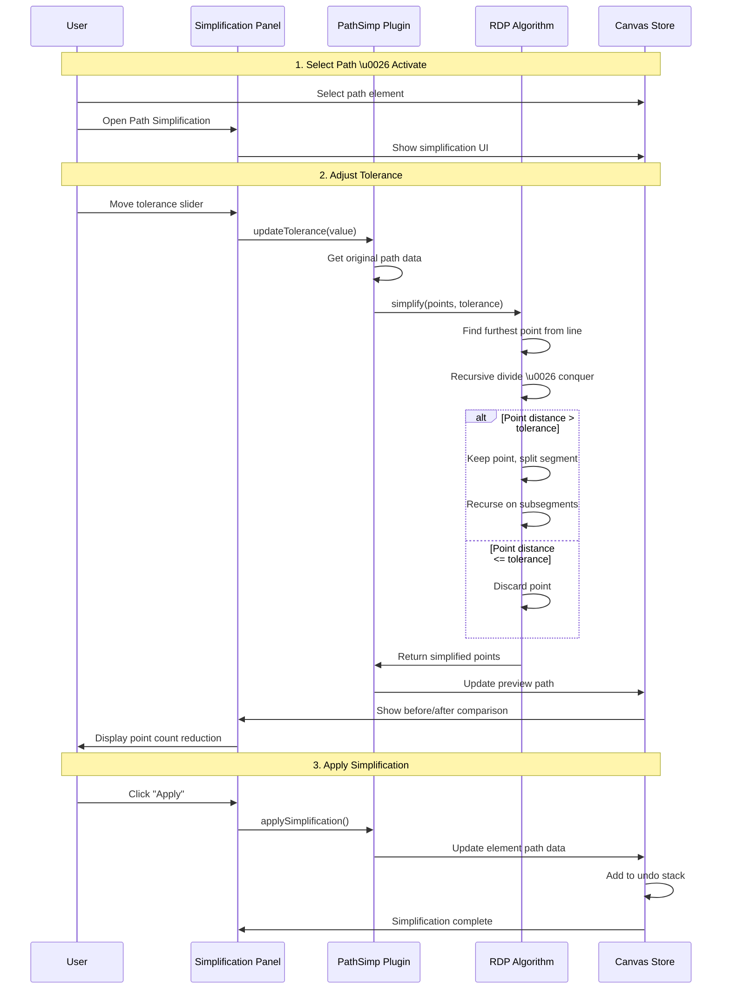
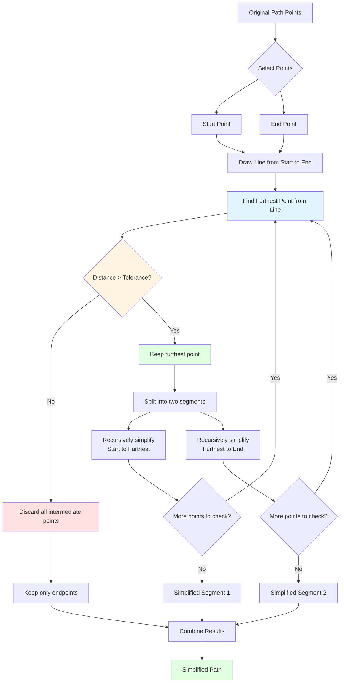
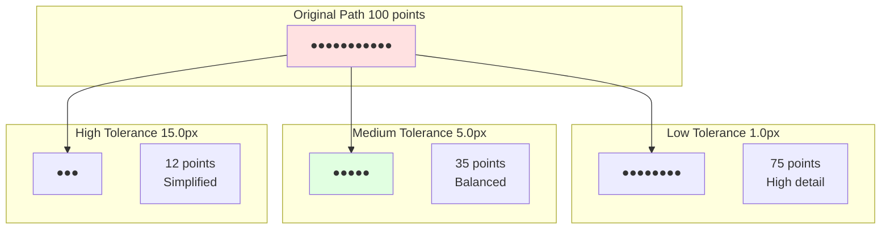

# Path Simplification Plugin

**Purpose**: Reduce the number of points in a path while preserving its shape

## Overview

The Path Simplification plugin optimizes complex paths by removing redundant points while maintaining the essential visual characteristics. This is particularly useful for paths created by freehand drawing, tracing, or import operations that often contain far more points than necessary.

**Key Features:**
- Interactive simplification with real-time preview
- Adjustable tolerance slider
- Ramer-Douglas-Peucker (RDP) algorithm
- Shape preservation guarantee
- Undo/redo support
- Significant file size reduction

## Plugin Interaction Flow



## Simplification Process (RDP Algorithm)



## Tolerance Comparison



## Handler

No direct handler - works through UI panel interactions on selected paths.

## Keyboard Shortcuts

| Shortcut | Action |
|----------|--------|
| `Shift+S` | Open Path Simplification panel |
| `Enter` | Apply current simplification |
| `Esc` | Cancel / Close panel |

## UI Contributions

### Panels

**PathSimplificationPanel**: Interactive simplification interface
- Tolerance slider (0.1 - 50.0 pixels)
- Before/after point count display
- Real-time preview toggle
- "Apply" and "Reset" buttons
- Visual comparison metrics

### Overlays

No overlays.

### Canvas Layers

**path-simplification-preview**: Preview layer (optional)
- Shows simplified path overlaid on original
- Different color to distinguish
- Dashed stroke for preview

## Technical Details

### Ramer-Douglas-Peucker Algorithm

The RDP algorithm works recursively:

```typescript
function rdpSimplify(
  points: Point[], 
  tolerance: number
): Point[] {
  if (points.length <= 2) return points;
  
  const first = points[0];
  const last = points[points.length - 1];
  
  // Find the point with maximum distance from line
  let maxDistance = 0;
  let maxIndex = 0;
  
  for (let i = 1; i < points.length - 1; i++) {
    const distance = perpendicularDistance(
      points[i], 
      first, 
      last
    );
    
    if (distance > maxDistance) {
      maxDistance = distance;
      maxIndex = i;
    }
  }
  
  // If max distance exceeds tolerance, split and recurse
  if (maxDistance > tolerance) {
    const left = rdpSimplify(
      points.slice(0, maxIndex + 1), 
      tolerance
    );
    const right = rdpSimplify(
      points.slice(maxIndex), 
      tolerance
    );
    
    return [...left.slice(0, -1), ...right];
  }
  
  // Otherwise, just return endpoints
  return [first, last];
}
```

### Distance Calculation

Perpendicular distance from point to line:

```typescript
function perpendicularDistance(
  point: Point, 
  lineStart: Point, 
  lineEnd: Point
): number {
  const dx = lineEnd.x - lineStart.x;
  const dy = lineEnd.y - lineStart.y;
  
  const numerator = Math.abs(
    dy * point.x - dx * point.y + 
    lineEnd.x * lineStart.y - 
    lineEnd.y * lineStart.x
  );
  
  const denominator = Math.sqrt(dx * dx + dy * dy);
  
  return numerator / denominator;
}
```

## State Management

```typescript
interface PathSimplificationSlice {
  pathSimplification: {
    tolerance: number;           // 0.1 - 50.0
    showPreview: boolean;
    originalPoints: number;
    simplifiedPoints: number;
    isActive: boolean;
  };
}
```

## Usage Examples

### Simplifying a Path

```typescript
import { simplifyPath } from '@/plugins/pathSimplification/actions';

// Simplify with 5px tolerance
simplifyPath({
  elementId: 'path-123',
  tolerance: 5.0
});
```

### Get Simplification Stats

```typescript
const state = useCanvasStore.getState();
const stats = state.pathSimplification;

console.log(`Reduced from ${stats.originalPoints} to ${stats.simplifiedPoints}`);
console.log(`Reduction: ${((1 - stats.simplifiedPoints / stats.originalPoints) * 100).toFixed(1)}%`);
```

## Implementation Details

**Location**: `src/plugins/pathSimplification/`

**Files**:
- `index.tsx`: Plugin definition
- `slice.ts`: State management
- `PathSimplificationPanel.tsx`: UI panel
- `algorithms/rdp.ts`: RDP algorithm implementation
- `utils/pathUtils.ts`: Path manipulation utilities

## Benefits

### File Size Reduction
- **Complex freehand paths**: 60-90% reduction
- **Traced paths**: 50-80% reduction
- **Simple geometric paths**: 10-30% reduction

### Performance Improvements
- Faster rendering with fewer points
- Reduced memory usage
- Smoother canvas interactions

### Visual Quality
- Maintains essential shape characteristics
- Removes imperceptible details
- Cleaner, more professional appearance

## Edge Cases & Limitations

- **Minimum Points**: Requires at least 3 points
- **Closed Paths**: Preserves closure
- **Bezier Curves**: Converts to polyline for simplification
- **Very High Tolerance**: May over-simplify
- **Undo**: Creates single undo entry per simplification

## Sidebar Configuration

```typescript
sidebarPanels: [
  {
    key: 'pathSimplification',
    condition: (ctx) => 
      !ctx.isInSpecialPanelMode && 
      ctx.selectedElements.length === 1 &&
      ctx.selectedElements[0].type === 'path',
    component: PathSimplificationPanel,
  },
]
```

## Related

- [Smooth Brush](./smooth-brush) - Creates smoother paths from the start
- [Edit Plugin](./edit) - Manual point editing
- [Path Plugin](./path) - Basic path operations
