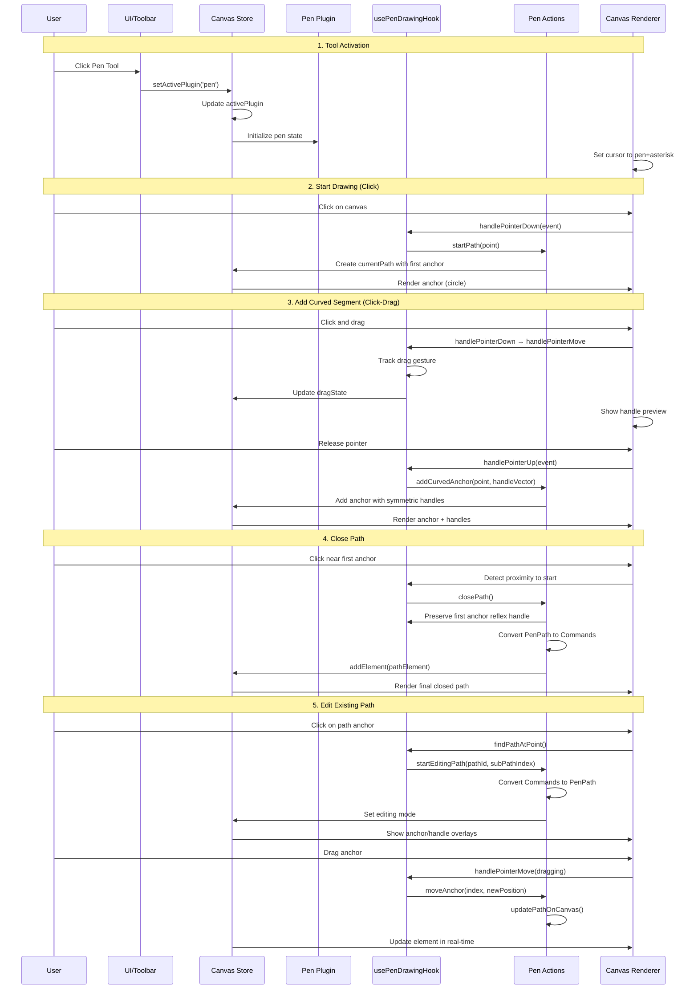
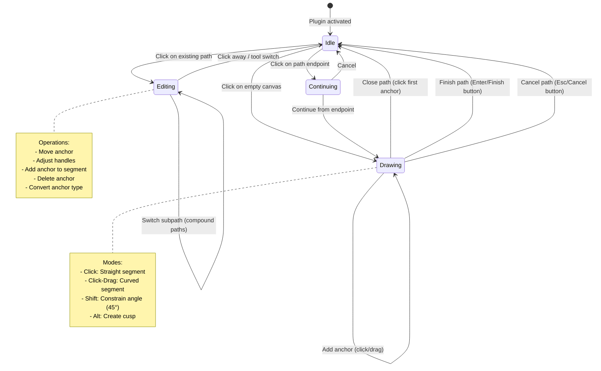
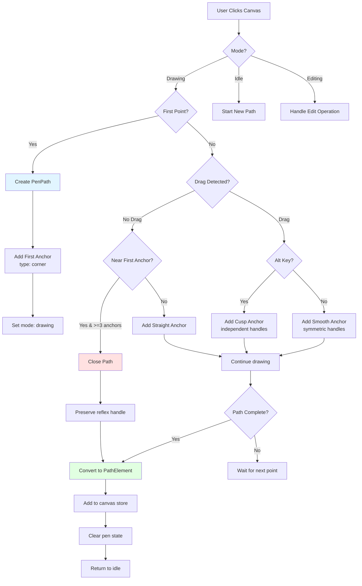
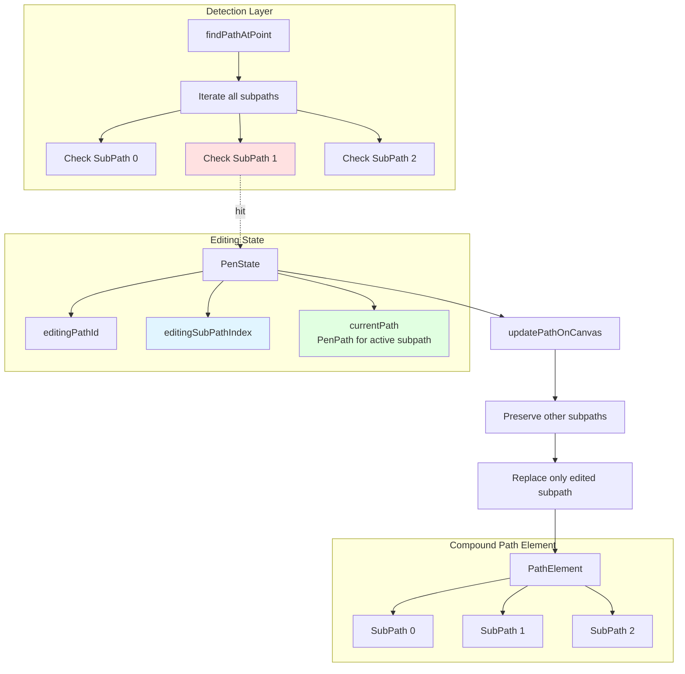
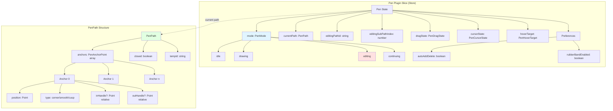
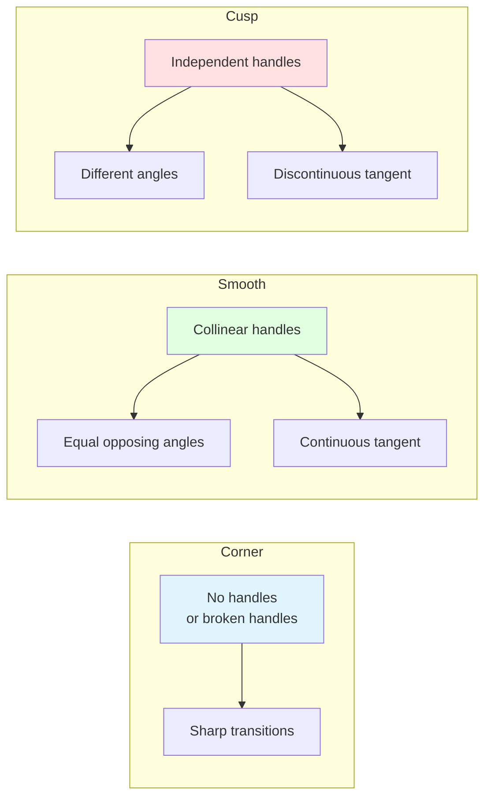
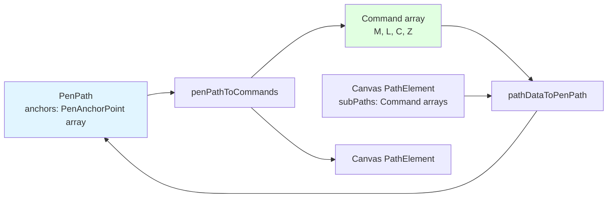

# Pen Plugin

**Purpose**: Precision vector path creation and editing with Bézier curves

## Overview

The Pen plugin provides professional-grade vector path creation and editing capabilities, similar to tools found in Adobe Illustrator or Figma.

**Core Features**:
- Create straight and curved path segments
- Edit existing paths (anchors, handles, segments)
- Support for compound paths (multiple subpaths)
- Smooth, cusp, and corner anchor types
- Real-time preview with rubber band
- Path closing with continuity preservation
- Mobile-friendly controls (Close/Finish/Cancel buttons)
- Snap-to-close for touch devices
- 45° angle constraints with Shift
- Move last anchor while drawing

## Plugin Interaction Flow



## Drawing State Machine



## Path Creation Process



## Compound Path Support



## State Management

The Pen plugin uses a comprehensive state slice with multiple operational modes:



**Key State Fields**:
- **mode**: Current operational mode (idle/drawing/editing/continuing)
- **currentPath**: Active path being drawn or edited
- **editingPathId**: ID of the canvas element being edited
- **editingSubPathIndex**: Which subpath in a compound path is being edited
- **hoverTarget**: What the cursor is hovering over (anchor/segment/etc.)
- **dragState**: Information about current drag operation
- **cursorState**: Visual cursor state for feedback

## Anchor Types



## Keyboard Shortcuts

| Key | Action | Mode |
|-----|--------|------|
| `Enter` | Finish current path | Drawing |
| `Escape` | Cancel current path | Drawing |
| `Shift` (hold) | Constrain angle to 45° | Drawing/Editing |
| `Shift` (before drag) | Move last anchor | Drawing |
| `Alt` (during drag) | Create cusp (independent handles) | Drawing |
| `Delete` | Delete selected anchor | Editing |

:::tip Mobile Support
For touch devices without keyboards, use the **Close**, **Finish**, and **Cancel** buttons in the Pen Panel.
:::

## UI Contributions

### Panels

**Pen Panel** provides:
- **Auto Add/Delete Toggle**: Automatically add anchors to segments or delete anchors on click
- **Close Path Button**: Close the current path (mobile-friendly)
- **Finish Path Button**: Finish the path as an open path (mobile-friendly)
- **Cancel Path Button**: Cancel and discard the current path (mobile-friendly)

:::note
The panel buttons are only visible when actively drawing a path.
:::

### Overlays

**PenPathOverlay** renders:
- Anchor points (circles) for the current path
- Direction handles (lines with circles) for curved anchors
- Handle manipulation controls
- Hover feedback for existing paths
- Visual close indicator (pulsing ring) near start point

### Canvas Layers

**RubberBandPreview** provides:
- Real-time preview of the next segment
- Dashed line for straight segments
- Curved preview for drag operations
- Handle preview during drag

## Public APIs

The Pen plugin exposes comprehensive path manipulation APIs:

```typescript
interface PenPluginAPI {
  // Path Creation
  startPath: (point: Point) => void;
  addStraightAnchor: (point: Point) => void;
  addCurvedAnchor: (point: Point, handleOut: Point) => void;
  closePath: () => void;
  finalizePath: () => void;
  cancelPath: () => void;
  
  // Path Editing
  startEditingPath: (pathId: string, subPathIndex: number) => void;
  moveAnchor: (index: number, newPosition: Point) => void;
  updateHandle: (index: number, handleType: 'in' | 'out', position: Point) => void;
  
  // Anchor Operations
  addAnchorToSegment: (segmentIndex: number, t: number) => void;
  deleteAnchor: (index: number) => void;
  convertAnchorType: (index: number, newType: AnchorPointType) => void;
  
  // Path Continuation
  continueFromEndpoint: (pathId: string, anchorIndex: number) => void;
}
```

**Usage**:
```typescript
const api = pluginManager.getPluginApi<PenPluginAPI>('pen');

// Start drawing
api?.startPath({ x: 100, y: 100 });
api?.addCurvedAnchor({ x: 200, y: 100 }, { x: 50, y: 0 });
api?.closePath();

// Edit existing path
api?.startEditingPath('path-123', 0);
api?.moveAnchor(2, { x: 150, y: 150 });
```

## Plugin Hooks

The Pen plugin uses a comprehensive hook system:

```typescript
hooks: [
  {
    id: 'pen-drawing',
    hook: usePenDrawingHook,
    global: false, // Only active when pen tool is active
  },
]
```

**usePenDrawingHook** manages:
- **Pointer Events**: Down, move, up gestures
- **Drag Detection**: Distinguish between click and drag
- **Path Detection**: Hover and click on existing paths/anchors
- **Cursor State**: Dynamic cursor changes based on context
- **Keyboard Modifiers**: Shift, Alt key handling
- **Snap Integration**: Grid and point snapping

## Sidebar Configuration

```typescript
sidebarPanels: [
  {
    key: 'pen',
    condition: (ctx) => !ctx.isInSpecialPanelMode && ctx.activePlugin === 'pen',
    component: PenPanel,
  },
]
```

Shows the PenPanel when:
- The pen tool is active
- Not in a special panel mode

## Path Conversion

The plugin converts between internal `PenPath` representation and SVG `Command[]`:



**Conversion Process**:
1. **penPathToCommands**: Converts anchors with handles to SVG commands (M, L, C, Z)
2. **pathDataToPenPath**: Parses SVG commands back to anchor structure
3. Handles are stored as **relative** to anchor position
4. Supports both straight (L) and curved (C) segments

## Usage Examples

```typescript
// Activate the plugin
useCanvasStore.getState().setActivePlugin('pen');

// Access plugin state
const penState = useCanvasStore(state => state.pen);

// Programmatically create a path
const api = pluginManager.getPluginApi<PenPluginAPI>('pen');
api?.startPath({ x: 100, y: 100 });
api?.addCurvedAnchor({ x: 200, y: 150 }, { x: 50, y: 25 });
api?.addStraightAnchor({ x: 300, y: 100 });
api?.closePath();
```

## Implementation Details

**Location**: `src/plugins/pen/`

**Key Files**:
- `index.ts`: Plugin definition and registration
- `slice.ts`: Zustand state slice for pen tool
- `types.ts`: TypeScript type definitions
- `actions.ts`: Path creation and editing actions
- `hooks/usePenDrawingHook.ts`: Main interaction hook
- `components/PenPathOverlay.tsx`: Visual overlays
- `components/RubberBandPreview.tsx`: Real-time preview
- `PenPanel.tsx`: Tool panel UI
- `utils/pathConverter.ts`: Path ↔ SVG conversion
- `utils/anchorDetection.ts`: Hit testing for paths/anchors
- `utils/cursorState.ts`: Cursor state calculation

## Edge Cases & Limitations

**Handled Edge Cases**:
- ✅ First point handle preservation (reflex handle for smooth closing)
- ✅ Compound path editing (multiple subpaths)
- ✅ Subpath switching while editing
- ✅ Snap-to-close for touch devices
- ✅ Duplicate anchor prevention
- ✅ Handle continuity on path closing

**Current Limitations**:
- Path endpoints must be detected manually (no visual indicator beyond hover)
- `continueFromEndpoint` currently defaults to subpath 0 for compound paths
- No visual feedback for invalid operations

**Performance Considerations**:
- Anchor detection uses spatial threshold (8px / zoom)
- Bézier curve distance calculations for segment detection
- Real-time path updates during editing (no debouncing)

## Related

- [Plugin System Overview](../overview)
- [Pencil Plugin](./pencil) - Freehand drawing alternative
- [Path Plugin](./path) - Boolean operations
- [Edit Plugin](./edit) - General editing capabilities
