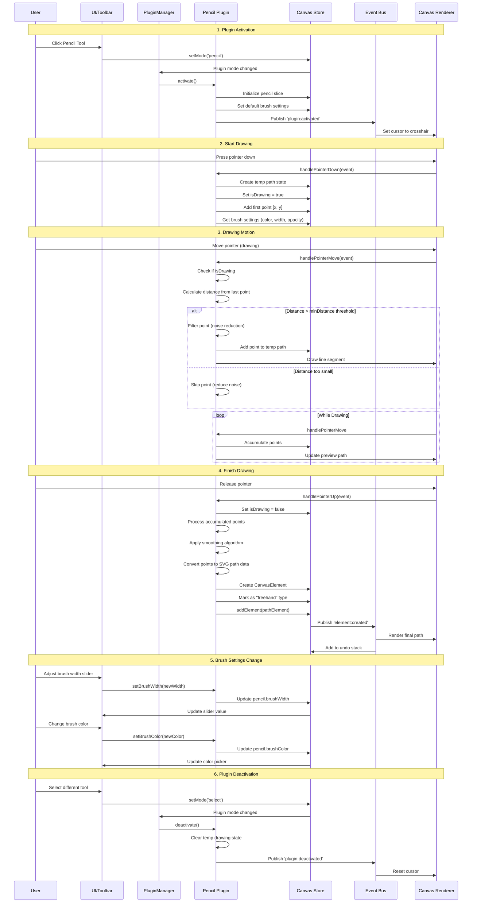
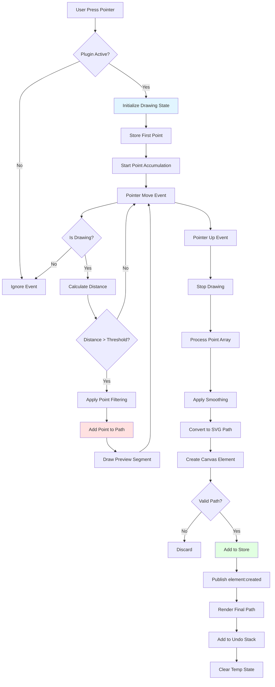
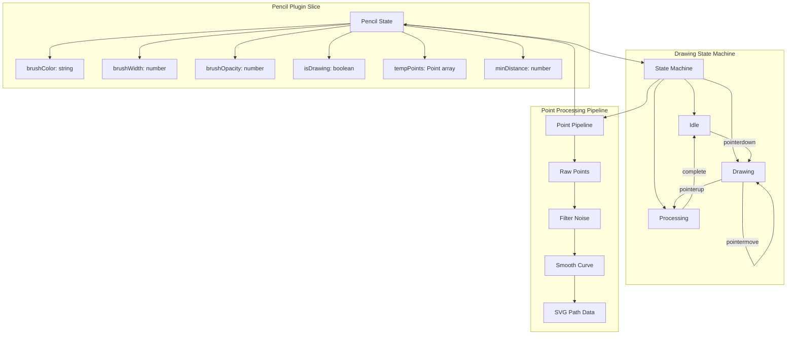

# Pencil Plugin

**Purpose**: Freehand drawing tool for creating paths

## Overview

- Freehand drawing
- Point filtering to reduce noise
- Minimum distance threshold
- Stroke customization (color, width, opacity)
- Marks paths as "freehand" for special handling

## Plugin Interaction Flow



## Drawing Process Diagram



## State Management



## Handler

Captures pointer movements and creates SVG paths

## Keyboard Shortcuts

No plugin-specific shortcuts.

## UI Contributions

### Panels

- Stroke color, width, and opacity controls

### Overlays

No overlays.

### Canvas Layers

No canvas layers.

## Public APIs

No public APIs exposed.

## Usage Examples

```typescript
// Activate the plugin
const state = useCanvasStore.getState();
state.setMode('pencil');

// Access plugin state
const pencilState = useCanvasStore(state => state.pencil);
```


## Implementation Details

**Location**: `src/plugins/pencil/`

**Files**:
- `index.ts`: Plugin definition
- `slice.ts`: Zustand slice (if applicable)
- `*Panel.tsx`: UI panels (if applicable)
- `*Overlay.tsx`: Overlays (if applicable)

## Edge Cases & Limitations

- Implementation-specific constraints
- Performance considerations for large datasets
- Browser compatibility notes (if any)

## Related

- [Plugin System Overview](../overview)
- [Event Bus](../../event-bus/overview)


