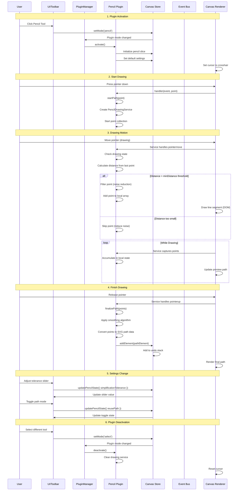

# Pencil Plugin

**Purpose**: Freehand drawing tool for creating paths

## Overview

- Freehand drawing
- Point filtering to reduce noise
- Minimum distance threshold
- Stroke customization (color, width, opacity)
- Marks paths as "freehand" for special handling

## Plugin Interaction Flow



## Drawing Process Diagram


## State Management

The Pencil plugin manages drawing state through **PencilDrawingService**, which handles point collection and path creation internally using local state and DOM manipulation, not through the Zustand store.


**Note**: The drawing state (`isDrawing`, temporary points) is NOT stored in Zustand. It's managed locally by PencilDrawingService for performance reasons.

## Handler

Captures pointer events and delegates to PencilDrawingService for path creation.

## Keyboard Shortcuts

- **Delete**: Delete selected elements

## UI Contributions

### Panels

**Pencil Panel** provides:
- **Path Mode Toggle**: Switch between "New Path" and "Add Subpath" modes
- **Tolerance Slider**: Adjust path simplification (0-10, step 0.1)

:::note
The panel does NOT provide color, width, or opacity controls. These are managed through the global style system.
:::

### Overlays

No overlays.

### Canvas Layers

No canvas layers.

## Public APIs

The Pencil plugin exposes the following public APIs:

```typescript
interface PencilPluginAPI {
  startPath: (point: Point) => void;
  addPointToPath: (point: Point) => void;
  finalizePath: (points: Point[]) => void;
}
```

**Usage**:
```typescript
const api = pluginManager.getPluginApi<PencilPluginAPI>('pencil');
api?.startPath({ x: 0, y: 0 });
api?.addPointToPath({ x: 10, y: 10 });
api?.finalizePath(collectedPoints);
```

## Usage Examples

```typescript
// Activate the plugin
const state = useCanvasStore.getState();
state.setMode('pencil');

// Access plugin state
const pencilState = useCanvasStore(state => state.pencil);
```


## Implementation Details

**Location**: `src/plugins/pencil/`

**Files**:
- `index.ts`: Plugin definition
- `slice.ts`: Zustand slice (if applicable)
- `*Panel.tsx`: UI panels (if applicable)
- `*Overlay.tsx`: Overlays (if applicable)

## Edge Cases & Limitations

- Implementation-specific constraints
- Performance considerations for large datasets
- Browser compatibility notes (if any)

## Related

- [Plugin System Overview](../overview)
- [Event Bus](../../event-bus/overview)


