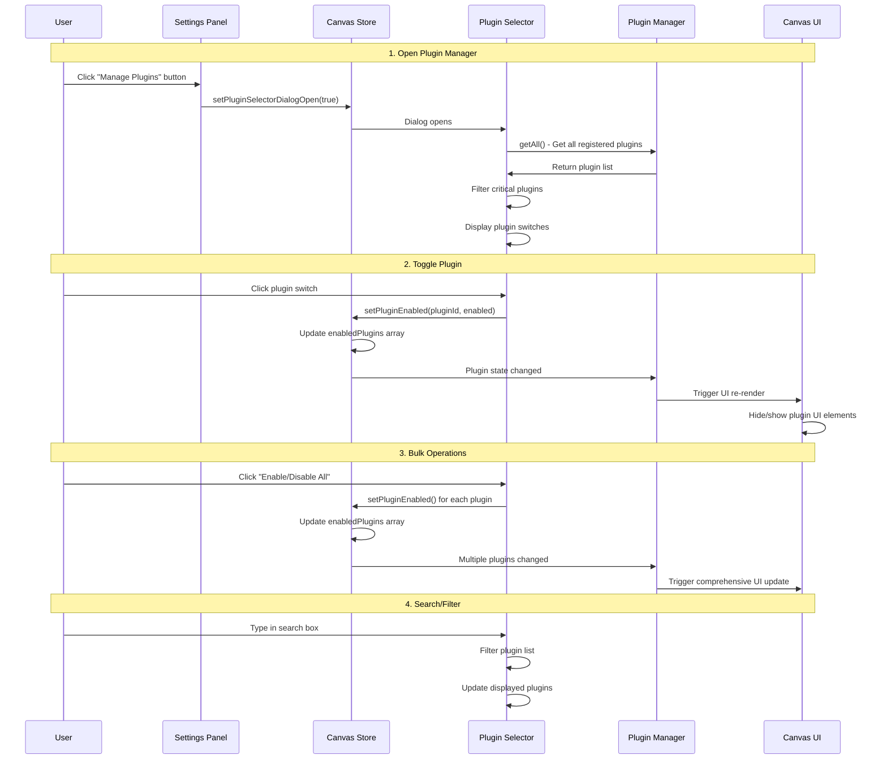
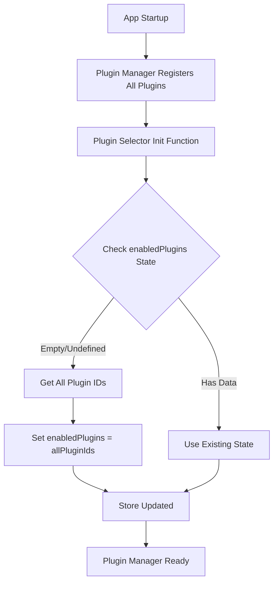

# Plugin Selector Plugin

**Purpose**: Dynamic plugin management and enablement control

## Overview

- Enable/disable plugins dynamically
- Search and filter available plugins
- Bulk enable/disable operations
- Critical plugin protection
- Persistent plugin state
- Real-time UI updates

## Plugin Interaction Flow



## State Management

The plugin maintains the following state:

```typescript
interface PluginSelectorSlice {
    pluginSelector: {
        enabledPlugins: string[];  // Array of enabled plugin IDs
        isDialogOpen: boolean;     // Dialog visibility state
    };
    setPluginEnabled: (pluginId: string, enabled: boolean) => void;
    setPluginSelectorDialogOpen: (isOpen: boolean) => void;
}
```

## Critical Plugins

Some plugins are marked as "critical" and cannot be disabled:

- `pluginSelector` - This plugin itself (prevents lockout)
- `select` - Basic selection functionality
- `pan` - Canvas navigation
- `file` - File operations
- `settings` - Application settings

## Initialization Process



## UI Components

### PluginSelectorDialog

Main modal dialog displaying:
- Search input for filtering plugins
- Enable/Disable All toggle
- Individual plugin switches
- Critical plugin indicators

### PluginSelectorAction

Settings panel button that opens the dialog.

## Integration Points

The plugin integrates with the entire application through:

1. **Plugin Manager**: Filters enabled plugins for UI rendering
2. **Canvas Store**: Maintains persistent plugin state
3. **UI Components**: Dynamic show/hide based on plugin availability
4. **Settings Panel**: Provides access to plugin management

## Usage Examples

### Enable a Plugin Programmatically

```typescript
const store = useCanvasStore();
store.setPluginEnabled('grid', true);
```

### Check if Plugin is Enabled

```typescript
const isEnabled = pluginManager.isPluginEnabled('grid');
```

### Get All Enabled Plugins

```typescript
const enabledPlugins = useCanvasStore(
  (state) => (state as any).pluginSelector.enabledPlugins
);
```

## Benefits

- **Performance**: Disable unused plugins to reduce bundle size and memory usage
- **UX**: Customize interface by hiding irrelevant tools
- **Development**: Easy testing of plugin combinations
- **Maintenance**: Clean separation of plugin functionality