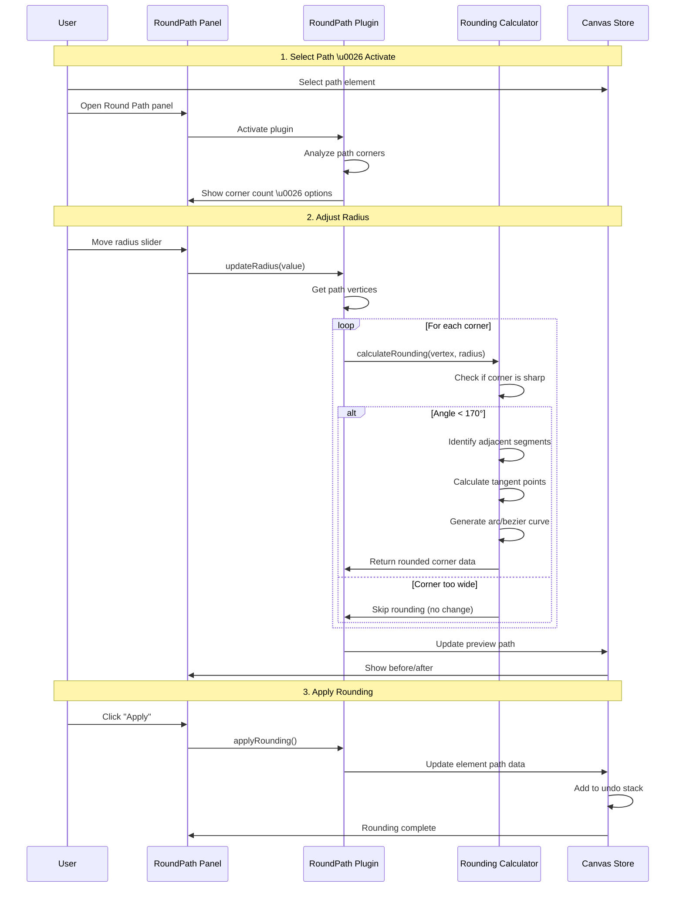
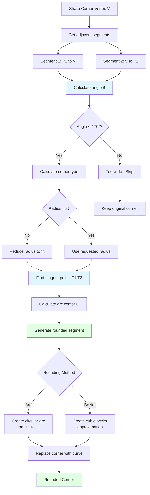
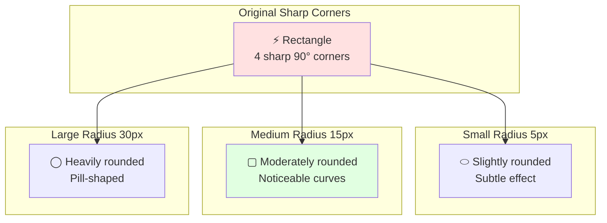

# Round Path Plugin

**Purpose**: Round the sharp corners of a path

## Overview

The Round Path plugin automatically converts sharp corners (vertices) in a path into smooth, rounded curves. This is useful for softening geometric shapes, creating design effects, or preparing paths for specific use cases like offset operations.

**Key Features:**
- Adjustable corner radius
- Real-time preview
- Preserves overall path shape
- Works on both open and closed paths
- Selective corner rounding (all corners or just sharp ones)

## Plugin Interaction Flow



## Corner Rounding Process



## Rounding Effect Comparison



## Handler

No direct handler - operates through UI panel on selected paths.

## Keyboard Shortcuts

| Shortcut | Action |
|----------|--------|
| `Shift+R` | Open Round Path panel |
| `Enter` | Apply current rounding |
| `Esc` | Cancel / Close panel |

## UI Contributions

### Panels

**RoundPathPanel**: Interactive rounding interface
- Radius slider (0 - 100 pixels)
- Preview toggle
- Corner selection options (all / sharp only)
- Before/after visualization
- "Apply" and "Reset" buttons

### Overlays

No overlays.

### Canvas Layers

**round-path-preview**: Preview layer
- Shows rounded path overlaid on original
- Highlights affected corners
- Dashed preview stroke

## Technical Details

### Corner Detection

Identifies corners by analyzing consecutive path segments:

```typescript
function findCorners(path: PathData): Corner[] {
  const corners: Corner[] = [];
  const commands = path.commands;
  
  for (let i = 1; i < commands.length - 1; i++) {
    const prev = commands[i - 1];
    const curr = commands[i];
    const next = commands[i + 1];
    
    if (curr.type === 'L') {  // Line command = potential corner
      const angle = calculateAngle(prev.end, curr.end, next.end);
      
      if (angle < 170) {  // Sharp corner threshold
        corners.push({
          index: i,
          position: curr.end,
          angle,
          segments: [prev, next]
        });
      }
    }
  }
  
  return corners;
}
```

### Rounding Calculation

Computes tangent points and arc:

```typescript
function roundCorner(
  corner: Corner,
  radius: number
): CurveSegment {
  const { position, segments } = corner;
  const [seg1, seg2] = segments;
  
  // Vector from corner to adjacent points
  const v1 = normalize(subtract(seg1.start, position));
  const v2 = normalize(subtract(seg2.end, position));
  
  // Tangent points at distance 'radius' from corner
  const t1 = add(position, scale(v1, radius));
  const t2 = add(position, scale(v2, radius));
  
  // Arc center (perpendicular to bisector)
  const bisector = normalize(add(v1, v2));
  const perpendicular = rotate90(bisector);
  const center = add(position, scale(perpendicular, radius));
  
  // Generate bezier approximation of arc
  return createArcBezier(t1, t2, center, radius);
}
```

### Radius Constraints

Prevents overlapping rounded corners:

```typescript
function constrainRadius(
  radius: number,
  corner: Corner
): number {
  const [seg1, seg2] = corner.segments;
  
  // Maximum radius = half of shortest adjacent segment
  const maxRadius = Math.min(
    length(seg1) / 2,
    length(seg2) / 2
  );
  
  return Math.min(radius, maxRadius);
}
```

## State Management

```typescript
interface RoundPathSlice {
  roundPath: {
    radius: number;              // 0-100
    roundSharpOnly: boolean;     // Only round acute angles
    angleThreshold: number;      // Degrees (default 170)
    showPreview: boolean;
    affectedCorners: number;
  };
}
```

## Usage Examples

### Rounding a Path

```typescript
import { roundPathCorners } from '@/plugins/roundPath/actions';

// Round all corners with 10px radius
roundPathCorners({
  elementId: 'path-123',
  radius: 10,
  sharpOnly: false
});
```

### Dynamic Radius Based on Size

```typescript
const element = getElement('path-123');
const bounds = getBounds(element);
const size = Math.min(bounds.width, bounds.height);

// Use 10% of smallest dimension as radius
const radius = size * 0.1;
roundPathCorners({ elementId: element.id, radius });
```

## Implementation Details

**Location**: `src/plugins/roundPath/`

**Files**:
- `index.tsx`: Plugin definition
- `RoundPathPanel.tsx`: UI panel
- `algorithms/rounding.ts`: Corner rounding math
- `utils/geometry.ts`: Geometric calculations

## Benefits

### Design Applications
- Softens harsh geometric shapes
- Creates friendly, approachable designs
- Mimics CSS `border-radius` effect
- Prepares paths for manufacturing (rounded corners are easier to cut)

### Technical Advantages
- Reduces stress concentrations in physical objects
- Smoother path offsetting
- Better for certain export formats

## Edge Cases & Limitations

- **Minimum Segments**: Requires at least 3 points
- **Radius Too Large**: Auto-constrains to prevent overlap
- **Very Sharp Corners**: May require smaller radius
- **Curved Segments**: Only rounds vertices between line segments
- **Closed Paths**: Handles path closure correctly

## Sidebar Configuration

```typescript
sidebarPanels: [
  {
    key: 'roundPath',
    condition: (ctx) => 
      !ctx.isInSpecialPanelMode &&
      ctx.selectedElements.length === 1 &&
      ctx.selectedElements[0].type === 'path',
    component: RoundPathPanel,
  },
]
```

## Related

- [Offset Path](./offset-path) - Create parallel paths
- [Path Operations](./path) - Boolean operations
- [Edit Plugin](./edit) - Manual corner editing
