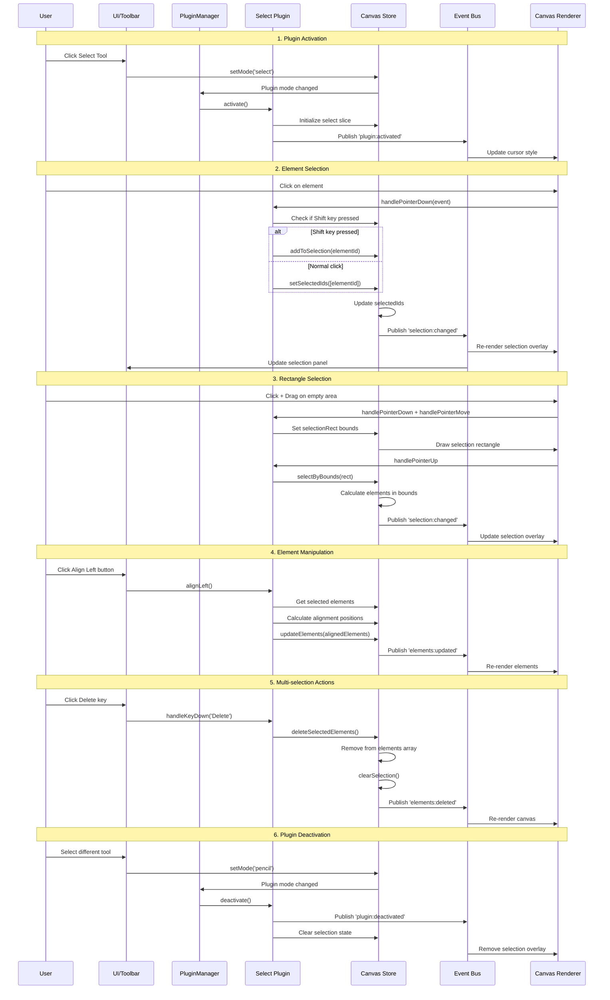
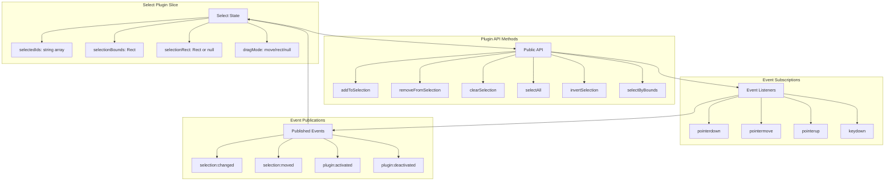

# Select Plugin

**Purpose**: Selection tool for picking, moving, and manipulating elements

## Overview

- Single and multi-select
- Shift-click to add/remove
- Rectangle selection
- Alignment (left, center, right, top, middle, bottom)
- Distribution (horizontal, vertical)
- Ordering (bring to front, send to back)
- Grouping and ungrouping

## Plugin Interaction Flow



## State Management Diagram



## Handler

Handles clicks on elements and canvas for selection

## Keyboard Shortcuts

- **Delete**: Delete selected elements
- **Ctrl/Cmd+A**: Select all (reserved)

## UI Contributions

### Panels

- Selection panel with alignment and distribution controls

### Overlays

- Selection rectangles and bounding boxes

### Canvas Layers

- Selection overlays showing bounds and handles for selected elements

## Public APIs

### `addToSelection`

Add element IDs to selection

### `removeFromSelection`

Remove from selection

### `clearSelection`

Clear all selected elements

## Usage Examples

```typescript
// Activate the plugin
const state = useCanvasStore.getState();
state.setMode('select');

// Access plugin state
const selectState = useCanvasStore(state => state.select);
```


## Calling Plugin APIs

```typescript
const api = pluginManager.getPluginApi('select');
api?.addToSelection();
api?.removeFromSelection();
api?.clearSelection();
```


## Implementation Details

**Location**: `src/plugins/select/`

**Files**:
- `index.ts`: Plugin definition
- `slice.ts`: Zustand slice (if applicable)
- `*Panel.tsx`: UI panels (if applicable)
- `*Overlay.tsx`: Overlays (if applicable)

## Edge Cases & Limitations

- Implementation-specific constraints
- Performance considerations for large datasets
- Browser compatibility notes (if any)

## Related

- [Plugin System Overview](../overview)
- [Event Bus](../../event-bus/overview)
- [Selection Feature](../../features/selection)

