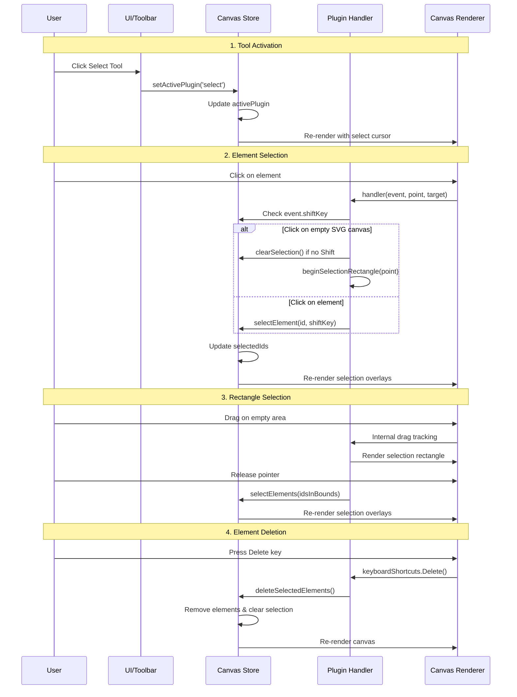
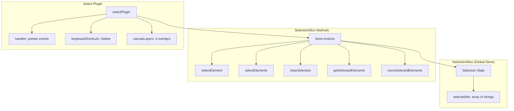

# Select Plugin

**Purpose**: Selection tool for picking, moving, and manipulating elements

## Overview

Selection functionality in TTPE includes:

- Single and multi-select with Shift-click to add/remove
- Rectangle selection (drag on empty area)
- Moving selected elements
- Deleting selected elements
- Grouping and ungrouping

:::note
**Alignment, distribution, and ordering** (bring to front, send to back) are provided by the [`useArrangeHandlers`](/docs/utilities/hooks#usearrangehandlers) hook and displayed in the **ArrangePanel** in the sidebar footer when elements are selected. These features are not part of the select plugin itself.
:::

## Plugin Interaction Flow



## State Management

The select plugin **does not have its own slice**. Selection state is managed in the global `SelectionSlice`:



## Handler

The plugin handler responds to pointer events on the canvas:

```typescript
handler: (event, point, target, context) => {
  // When clicking on empty SVG canvas
  if (target.tagName === 'svg') {
    // Clear selection unless Shift is held
    if (!event.shiftKey) {
      const state = context.store.getState();
      state.clearSelection?.();
    }
    // Begin rectangle selection
    context.helpers.beginSelectionRectangle?.(point);
  }
}
```

## Keyboard Shortcuts

- **Delete**: Delete selected elements (removes from canvas and clears selection)

## Canvas Layers

The select plugin renders **4 canvas layers**:

1. **selection-overlays** (midground): Selection overlays for individual path elements showing control points
2. **group-selection-bounds** (midground): Dashed rectangles around selected groups
3. **selection-rectangle** (midground): Live rectangle during drag-to-select
4. **selection-blocking-overlay** (midground): Blocks interactions during rectangle selection

## Public APIs

**The select plugin does not expose a `createApi`**. Selection is managed through the global `SelectionSlice` in the Canvas Store.

:::note
Selection functionality is part of the core Canvas Store (SelectionSlice), not a plugin API. Use the store methods directly:
```typescript
const state = useCanvasStore.getState();
state.selectElement(elementId);
state.selectElements([id1, id2]);
state.clearSelection();
state.getSelectedElements();
state.moveSelectedElements(deltaX, deltaY);
```
See the [Canvas Store API](/docs/api/canvas-store-api) for more details.
:::

## Usage Examples

### Activating the Select Tool

```typescript
const state = useCanvasStore.getState();
state.setActivePlugin('select');
```

### Working with Selection

```typescript
// Access selection state
const selectedIds = useCanvasStore(state => state.selectedIds);

// Select an element
const state = useCanvasStore.getState();
state.selectElement(elementId, false); // false = replace selection

// Multi-select
state.selectElement(elementId2, true); // true = add to selection

// Select multiple elements
state.selectElements([id1, id2, id3]);

// Clear selection
state.clearSelection();

// Get selected elements
const selected = state.getSelectedElements();

// Move selected elements
state.moveSelectedElements(10, 20); // deltaX, deltaY
```

## Implementation Details

**Location**: `src/plugins/index.tsx` (embedded in main plugin file)

The select plugin is defined inline within the `CORE_PLUGINS` array and does not have a separate directory.

**Related State**: `src/store/slices/features/selectionSlice.ts`

## Edge Cases & Limitations

- **No dedicated plugin slice**: Selection state lives in the global `SelectionSlice`, not a plugin-specific slice
- **No lifecycle hooks**: The plugin doesn't have `activate()` or `deactivate()` methods
- **Hidden/locked elements**: Elements marked as hidden or locked cannot be selected (checked in `selectElement` and `selectElements`)
- **Subpath clearing**: When switching selection to a different path in select mode, any selected subpaths are automatically cleared
- **Rectangle selection**: Only works when clicking on the empty SVG canvas (not on elements)

## Related

- [Plugin System Overview](../overview)
- [Canvas Store API](/docs/api/canvas-store-api)
- [SelectionSlice](/docs/architecture/store-slices#selectionslice)

