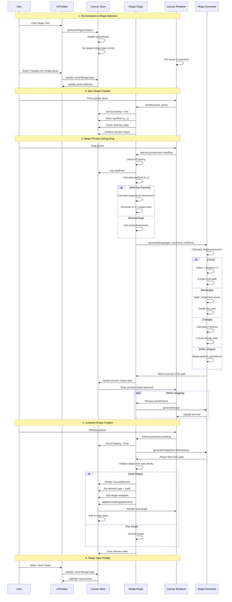
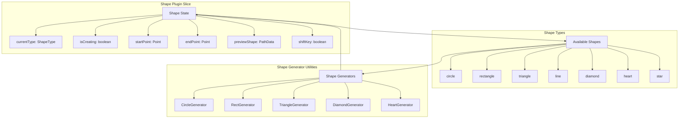

# Shape Plugin

**Purpose**: Create parametric shapes (circle, square, triangle, etc.)

## Overview

- Shapes: square, rectangle, circle, triangle, line, diamond, heart
- Two-point creation (drag to define size)
- Shift key for proportional shapes:
  - **Circle/Rectangle**: Creates perfect circles and squares
  - **Triangle**: Creates equilateral triangles
  - **Line**: Constrains to horizontal, vertical, or 45° diagonal angles
- Preview during creation
- Converts to editable paths

## Plugin Interaction Flow



## Shape Generation Process

```mermaid
flowchart TD
    A[User Starts Drag] --> B[Store Start Point]
    B --> C{Shape Type?}
    
    C -->|Circle| D1[Calculate Radius]
    C -->|Rectangle| D2[Calculate Width/Height]
    C -->|Triangle| D3[Calculate Vertices]
    C -->|Line| D4[Calculate Line Points]
    C -->|Diamond| D5[Calculate 4 Points]
    C -->|Heart| D6[Heart Bezier Curves]
    
    D1 --> E1{Shift Key?}
    D2 --> E2{Shift Key?}
    D3 --> E3{Shift Key?}
    D4 --> E4{Shift Key?}
    
    E1 -->|Yes| F1[Perfect Circle]
    E1 -->|No| F1b[Ellipse]
    E2 -->|Yes| F2[Square]
    E2 -->|No| F2b[Rectangle]
    E3 -->|Yes| F3[Equilateral Triangle]
    E3 -->|No| F3b[Scalene Triangle]
    E4 -->|Yes| F4[Constrained Line]
    E4 -->|No| F4b[Free Line]
    
    F4 --> F4_1{Angle?}
    F4_1 -->|0° or 180°| F4_H[Horizontal Line]
    F4_1 -->|90° or 270°| F4_V[Vertical Line]
    F4_1 -->|45°, 135°, 225°, 315°| F4_D[Diagonal Line]
    
    D5 --> G5[Diamond Path]
    D6 --> G6[Heart Path]
    
    F1 --> H[Generate SVG Path]
    note right of F1: Uses BEZIER_CIRCLE_KAPPA (0.551915024494) to compute control points for a more accurate Bezier approximation of a circle.
    F1b --> H
    F2 --> H
    F2b --> H
    F3 --> H
    F3b --> H
    F4b --> H
    F4_H --> H
    F4_V --> H
    F4_D --> H
    G5 --> H
    G6 --> H
    
    H --> I[Update Preview]
    I --> J{Still Dragging?}
    J -->|Yes| K[Wait for Move Event]
    K --> C
    J -->|No| L[Pointer Up]
    
    L --> M{Valid Size?}
    M -->|Yes| N[Create Element]
    M -->|No| O[Discard]
    
    N --> P[Add to Canvas]
    P --> Q[Clear Preview]
    
    style D1 fill:#e1f5ff
    style D2 fill:#e1f5ff
    style D3 fill:#e1f5ff
    style D4 fill:#e1f5ff
    style F4 fill:#fff4e1
    style F4_H fill:#e1ffe1
    style F4_V fill:#e1ffe1
    style F4_D fill:#e1ffe1
    style N fill:#e1ffe1
    style O fill:#ffe1e1
```

## State Management



## Handler

Two-point shape creation with preview

## Keyboard Shortcuts

| Key | Action |
| --- | ------ |
| `Esc` | Cancel shape creation / return to Select tool |

### Modifier Keys

The **Shift** key provides constrained drawing for different shape types:

| Shape Type | Normal Behavior | Shift Key Behavior |
|-----------|----------------|-------------------|
| **Circle** | Free ellipse | Perfect circle (1:1 aspect ratio) |
| **Rectangle** | Free rectangle | Perfect square (1:1 aspect ratio) |
| **Triangle** | Scalene triangle | Equilateral triangle |
| **Line** | Free angle line | Constrained to 8 directions:<br/>- Horizontal (0°, 180°)<br/>- Vertical (90°, 270°)<br/>- Diagonal (45°, 135°, 225°, 315°) |
| **Diamond** | Free diamond | Square diamond |
| **Heart** | No constraint | No constraint |
| **Star** | No constraint | No constraint |

#### Line Constraints with Shift

When drawing lines with Shift pressed, the line snaps to the nearest 45° angle:

```
        90° (↑)
         |
135° ↖  |  ↗ 45°
    ----+----  0° (→)
225° ↙  |  ↘ 315°
         |
       270° (↓)
```

This makes it easy to draw perfectly horizontal, vertical, or diagonal lines without manual precision.

## UI Contributions

### Panels

- Shape type selector

### Overlays

No overlays.

### Canvas Layers

- Preview layer showing shape during creation

## Public APIs

The Shape plugin exposes the following public API:

### `createShape(startPoint: Point, endPoint: Point)`

Creates a shape between two points.

**Parameters**:
- `startPoint`: A `Point` object with `x` and `y` coordinates for the start position
- `endPoint`: A `Point` object with `x` and `y` coordinates for the end position

**Usage**:
```typescript
const api = useCanvasStore.getState().getPluginApi('shape');
api.createShape(
  { x: 50, y: 50 },
  { x: 150, y: 150 }
);
```

## Usage Examples

```typescript
// Activate the plugin
const state = useCanvasStore.getState();
state.setMode('shape');

// Access plugin state
const shapeState = useCanvasStore(state => state.shape);
```


## Implementation Details

**Location**: `src/plugins/shape/`

**Files**:
- `index.ts`: Plugin definition
- `slice.ts`: Zustand slice (if applicable)
- `*Panel.tsx`: UI panels (if applicable)
- `*Overlay.tsx`: Overlays (if applicable)

## Edge Cases & Limitations

- Implementation-specific constraints
- Performance considerations for large datasets
- Browser compatibility notes (if any)

## Minimum Movement Threshold (Click Tolerance) ⚠️

To prevent tiny or accidental shapes from being created when users only click or perform a very small movement, the Shape tool now requires a minimum pointer movement between pointerDown and pointerUp before creating an element. This prevents unusable tiny elements and avoids creating unnecessary undo history entries.

- Default threshold: **5 pixels** (Euclidean distance)
- Behavior: If the movement between pointerDown and pointerUp is less than the configured threshold, the shape creation is cancelled and nothing is added to the canvas or undo stack.
- Rationale: Prevents creating tiny shapes from accidental clicks and improves UX.

## Configuration

- You can configure this threshold by updating the constant in the plugin configuration file:

```ts
// src/plugins/shape/config.ts
export const MIN_SHAPE_CREATION_DISTANCE = 5; // in pixels
```

Adjust the value to increase or decrease the sensitivity (for example, set to 3 for a more permissive threshold, or 10 to require a longer drag to create shapes).

Note: Because the threshold validation happens before the element is added to the store, tiny clicks do not produce elements or create entries on the undo/redo stack.

## Sidebar Configuration

The Shape plugin uses **declarative sidebar panels**:

```typescript
sidebarPanels: [
  {
    key: 'shape',
    condition: (ctx) => !ctx.isInSpecialPanelMode && ctx.activePlugin === 'shape',
    component: ShapePanel,
  },
]
```

The **ShapePanel** automatically appears when:
- The shape tool is active
- Not in a special panel mode

**Panel Features:**
- Shape type selector (circle, rectangle, triangle, line, diamond, heart, star)
- "Keep shape mode" toggle to stay in shape mode after creation
- Visual shape icons for intuitive selection

## Related

- [Plugin System Overview](../overview)
- [Event Bus](../../event-bus/overview)
