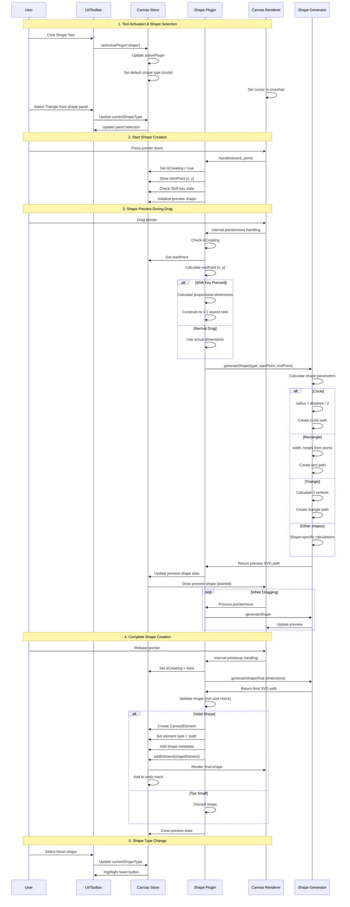
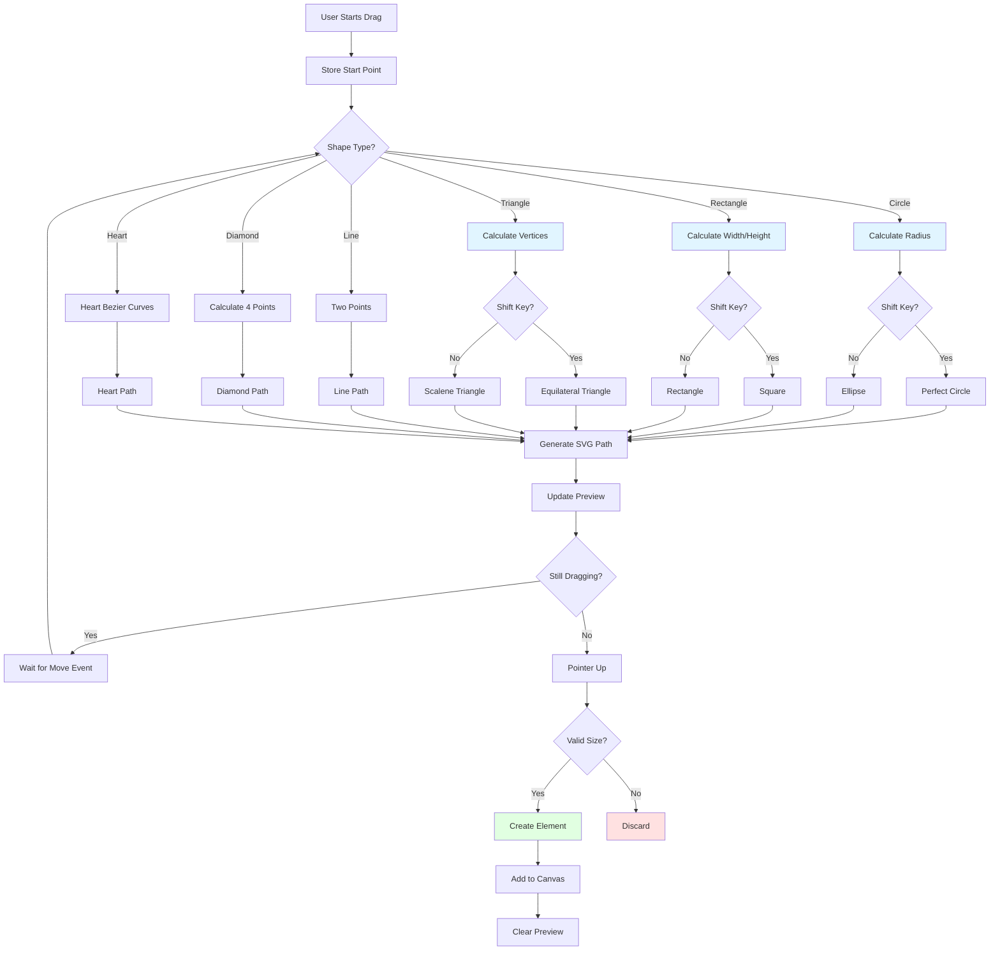
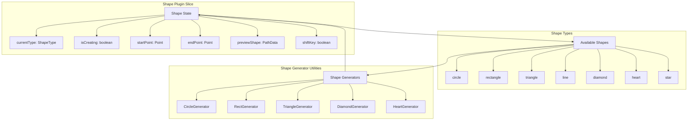

# Shape Plugin

**Purpose**: Create parametric shapes (circle, square, triangle, etc.)

## Overview

- Shapes: square, rectangle, circle, triangle, line, diamond, heart
- Two-point creation (drag to define size)
- Shift key for proportional shapes
- Preview during creation
- Converts to editable paths

## Plugin Interaction Flow



## Shape Generation Process



## State Management



## Handler

Two-point shape creation with preview

## Keyboard Shortcuts

No plugin-specific shortcuts.

## UI Contributions

### Panels

- Shape type selector

### Overlays

No overlays.

### Canvas Layers

- Preview layer showing shape during creation

## Public APIs

The Shape plugin exposes the following public API:

### `createShape(startPoint: Point, endPoint: Point)`

Creates a shape between two points.

**Parameters**:
- `startPoint`: A `Point` object with `x` and `y` coordinates for the start position
- `endPoint`: A `Point` object with `x` and `y` coordinates for the end position

**Usage**:
```typescript
const api = useCanvasStore.getState().getPluginApi('shape');
api.createShape(
  { x: 50, y: 50 },
  { x: 150, y: 150 }
);
```

## Usage Examples

```typescript
// Activate the plugin
const state = useCanvasStore.getState();
state.setMode('shape');

// Access plugin state
const shapeState = useCanvasStore(state => state.shape);
```


## Implementation Details

**Location**: `src/plugins/shape/`

**Files**:
- `index.ts`: Plugin definition
- `slice.ts`: Zustand slice (if applicable)
- `*Panel.tsx`: UI panels (if applicable)
- `*Overlay.tsx`: Overlays (if applicable)

## Edge Cases & Limitations

- Implementation-specific constraints
- Performance considerations for large datasets
- Browser compatibility notes (if any)

## Related

- [Plugin System Overview](../overview)
- [Event Bus](../../event-bus/overview)


