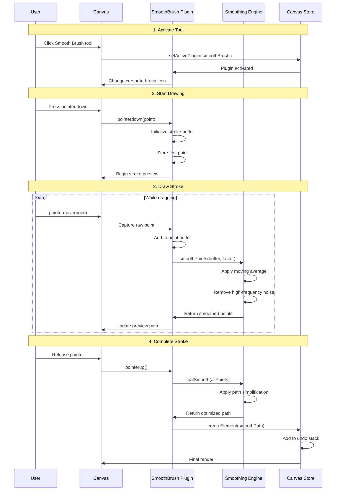
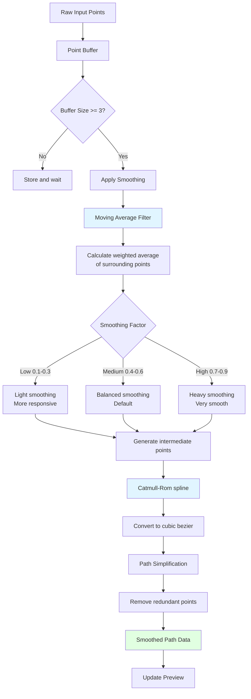

# Smooth Brush Plugin

**Purpose**: Draw freehand paths with automatic smoothing and stabilization

## Overview

The Smooth Brush plugin enables natural, freehand drawing on the canvas with real-time path smoothing and stabilization. Unlike raw pointer input, it applies intelligent algorithms to reduce jitter and create clean, professional curves while maintaining the artist's intent.

**Key Features:**
- Real-time stroke smoothing during drawing
- Adjustable smoothing intensity
- Pressure sensitivity support (when available)
- Customizable brush size
- Live preview while drawing
- Automatic path optimization

## Plugin Interaction Flow



## Smoothing Algorithm



## Handler

The SmoothBrush plugin captures all pointer events during drawing:
- Buffers points for real-time smoothing
- Applies configurable smoothing algorithms
- Generates preview path on-the-fly
- Finalizes path on pointer release

## Keyboard Shortcuts

| Shortcut | Action |
|----------|--------|
| `B` | Activate Smooth Brush tool |
| `Esc` | Cancel current stroke / Return to Select |
| `[` | Decrease brush size |
| `]` | Increase brush size |

## UI Contributions

### Panels

**SmoothBrushPanel**: Brush configuration
- Brush size slider (1-100px)
- Smoothing factor slider (0-100%)
- Pressure sensitivity toggle
- Preview of current brush settings
- Real-time visual feedback

### Overlays

**SmoothBrushCursor**: Custom cursor display
- Shows brush size preview
- Updates position in real-time
- Displays as a circle matching brush width

### Canvas Layers

**smooth-brush-preview**: Drawing preview layer
- Placement: `midground`
- Shows stroke as it's being drawn
- Real-time smoothing visualization
- Dashed preview line

## Configuration

The plugin provides several adjustable parameters:

### Size
Controls the stroke width:
- **Range**: 1-100 pixels
- **Default**: 10 pixels
- **Effect**: Determines the visual thickness of the drawn path

### Smoothing Factor
Controls the intensity of smoothing:
- **Range**: 0-100% (internally 0.0-1.0)
- **Default**: 50% (0.5)
- **Low (0-30%)**: Minimal smoothing, follows hand closely
- **Medium (40-60%)**: Balanced, good for most use cases
- **High (70-100%)**: Maximum smoothing, very fluid curves

### Pressure Sensitivity
- **Enabled**: Stroke width varies with pen pressure
- **Disabled**: Constant stroke width
- **Requires**: Pressure-sensitive input device

## Technical Details

### Smoothing Algorithm

The plugin uses a combination of techniques:

1. **Moving Average Filter**:
```typescript
function movingAverage(points: Point[], windowSize: number): Point[] {
  return points.map((point, i, arr) => {
    const start = Math.max(0, i - Math.floor(windowSize / 2));
    const end = Math.min(arr.length, i + Math.ceil(windowSize / 2));
    const window = arr.slice(start, end);
    
    return {
      x: window.reduce((sum, p) => sum + p.x, 0) / window.length,
      y: window.reduce((sum, p) => sum + p.y, 0) / window.length,
    };
  });
}
```

2. **Catmull-Rom Spline**: Generates smooth curves through points
3. **Bezier Conversion**: Converts spline to SVG path format
4. **Path Simplification**: Removes redundant points using RDP algorithm

## State Management

```typescript
interface SmoothBrushSlice {
  smoothBrush: {
    size: number;                    // Brush width
    smoothingFactor: number;         // 0-1
    pressureSensitive: boolean;
    isDrawing: boolean;
    currentStroke: Point[];          // Raw points
    previewPath: string;             // SVG path data
  };
}
```

## Usage Examples

### Activating the Tool

```typescript
const state = useCanvasStore.getState();
state.setActivePlugin('smoothBrush');
```

### Configuring Brush Settings

```typescript
import { useCanvasStore } from '@/store/canvasStore';

const updateBrushSize = (size: number) => {
  useCanvasStore.setState((state) => ({
    smoothBrush: {
      ...state.smoothBrush,
      size: Math.max(1, Math.min(100, size)),
    },
  }));
};
```

## Implementation Details

**Location**: `src/plugins/smoothBrush/`

**Files**:
- `index.tsx`: Plugin definition and registration
- `slice.ts`: Zustand state management
- `SmoothBrushPanel.tsx`: Configuration UI
- `SmoothBrushCursor.tsx`: Custom cursor rendering
- `hooks/useCanvasSmoothBrush.ts`: Canvas interaction logic
- `hooks/useEditSmoothBrush.ts`: Edit mode integration
- `hooks/useSmoothBrushHook.ts`: Main plugin hook
- `utils/smoothing.ts`: Smoothing algorithms

## Edge Cases & Limitations

- **Minimum Points**: Requires at least 3 points for smoothing
- **Performance**: Very long strokes may impact performance
- **Pressure Support**: Only works with compatible devices
- **Smoothing Trade-off**: Higher smoothing = less responsive feel
- **Memory**: Large stroke buffers are cleared after completion

## Sidebar Configuration

```typescript
sidebarPanels: [
  {
    key: 'smoothBrush',
    condition: (ctx) => !ctx.isInSpecialPanelMode && ctx.activePlugin === 'smoothBrush',
    component: SmoothBrushPanel,
  },
]
```

## Related

- [Pencil Plugin](./pencil) - Raw freehand drawing without smoothing
- [Curves Plugin](./curves) - Precise bezier curve control
- [Path Simplification](./path-simplification) - Optimize existing paths
