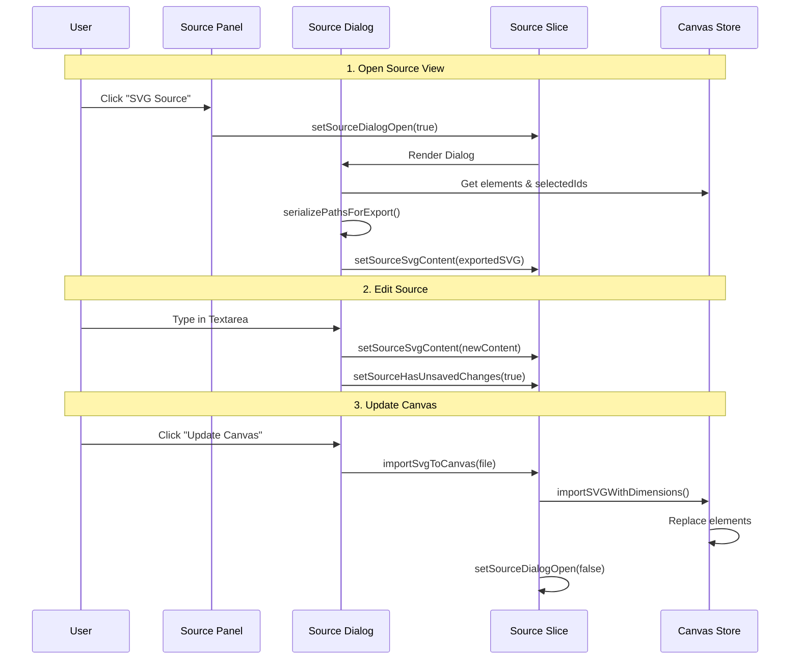

# Source Plugin

**Purpose**: Allows users to view, edit, and re-import the raw SVG source code of the current canvas.

## Overview

-   **Export**: Automatically exports the current canvas state to SVG format when the dialog opens.
-   **Edit**: Provides a code editor (textarea) to modify the SVG source directly.
-   **Import**: Re-imports the modified SVG back into the canvas, replacing existing elements.
-   **Clipboard**: Supports copying the SVG source to the clipboard.
-   **Validation**: Tracks unsaved changes and prevents importing invalid SVG (basic error handling).

## Plugin Interaction Flow



## State Management

The Source plugin manages its state via `SourcePluginSlice` within the main Canvas Store.

```typescript
interface SourcePluginSlice {
  source: {
    isDialogOpen: boolean;        // Controls dialog visibility
    svgContent: string;           // Current SVG source content
    hasUnsavedChanges: boolean;   // Tracks if source has been modified
  };
  setSourceDialogOpen: (isOpen: boolean) => void;
  setSourceSvgContent: (content: string) => void;
  setSourceHasUnsavedChanges: (hasChanges: boolean) => void;
  importSvgToCanvas: (file: File) => Promise<void>;
}
```

## UI Contributions

### Panels

**Source Panel**:
-   Located in the **File** sidebar.
-   Contains a button to open the Source Dialog.

### Dialogs

**Source Dialog**:
-   Modal dialog containing a large textarea for SVG editing.
-   **Clear**: Clears the editor.
-   **Copy**: Copies content to clipboard.
-   **Update Canvas**: Parses the SVG and updates the canvas.

## Implementation Details

**Location**: `src/plugins/source/`

**Files**:
-   `index.ts`: Plugin definition and registration.
-   `sourcePluginSlice.ts`: Zustand slice for state and actions.
-   `SourcePanel.tsx`: Sidebar panel component.
-   `SourceDialog.tsx`: Modal dialog component.

## Usage

1.  Open the **File** tab in the sidebar.
2.  Click the **SVG Source** button in the "Source" panel.
3.  View or edit the SVG code.
4.  Click **Update Canvas** to apply changes, or **Copy** to export the code.
