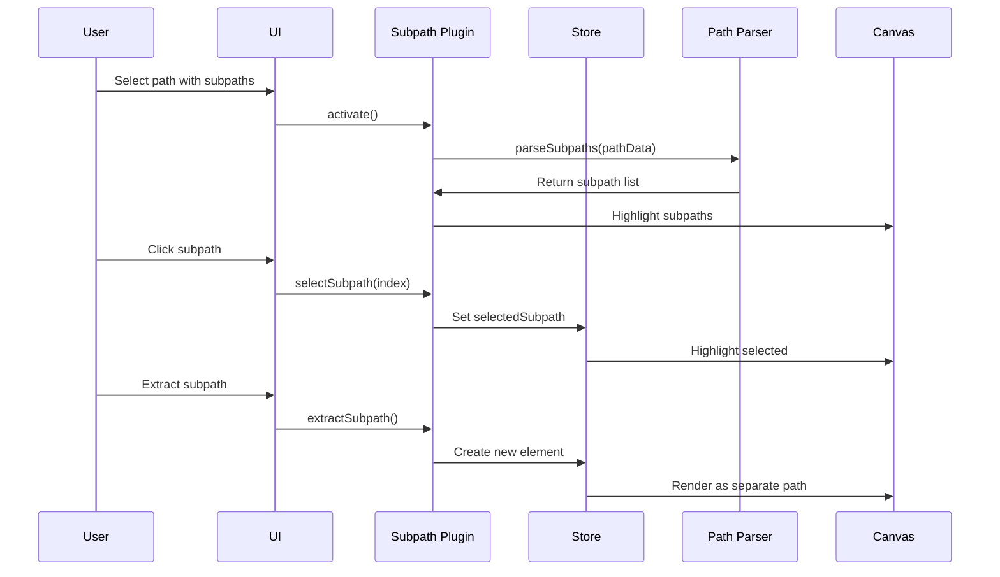

# Subpath Plugin

**Purpose**: Manage individual subpaths within complex paths

## Overview

- Select individual subpaths\n- Multi-select subpaths (constrained to single element)\n- Delete subpaths\n- Reorder subpaths\n- Align and distribute subpaths\n- Split subpaths into separate paths\n- Reverse subpath direction

## Plugin Interaction Flow



## Handler

## Handler

Select subpaths within paths

## Keyboard Shortcuts

No plugin-specific shortcuts.

## UI Contributions

### Panels

- Subpath list, align/distribute controls

### Overlays

No overlays.

### Canvas Layers

- Subpath highlights and selection indicators

## Public APIs

No public APIs exposed.

## Usage Examples

```typescript
// Activate the plugin
const state = useCanvasStore.getState();
state.setMode('subpath');

// Access plugin state
const subpathState = useCanvasStore(state => state.subpath);
```


## Implementation Details

**Location**: `src/plugins/subpath/`

**Files**:
- `index.ts`: Plugin definition
- `slice.ts`: Zustand slice (if applicable)
- `*Panel.tsx`: UI panels (if applicable)
- `*Overlay.tsx`: Overlays (if applicable)

## Edge Cases & Limitations

- Implementation-specific constraints
- Performance considerations for large datasets
- Browser compatibility notes (if any)

## Related

- [Plugin System Overview](../overview)
- [Event Bus](../../event-bus/overview)


