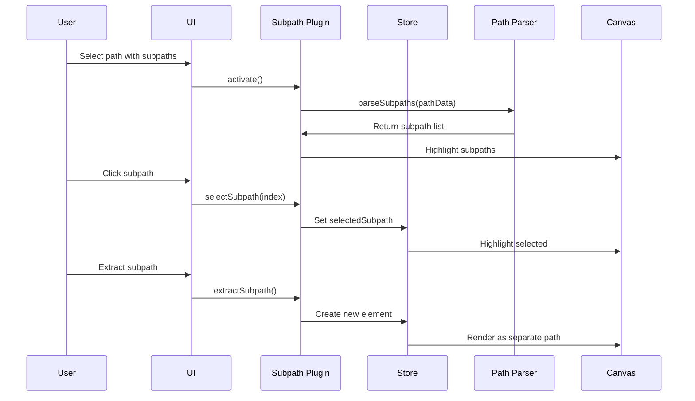

# Subpath Plugin

**Purpose**: Manage individual subpaths within complex paths

## Overview

- Select individual subpaths
- Multi-select subpaths (constrained to single element)
- Delete subpaths
- Reorder subpaths
- Align and distribute subpaths
- Split subpaths into separate paths
- Reverse subpath direction

## Plugin Interaction Flow



## Handler

## Handler

Select subpaths within paths

## Keyboard Shortcuts

No plugin-specific shortcuts.

## UI Contributions

### Panels

- Subpath list, align/distribute controls

### Overlays

- **SubpathOverlay**: Visual rendering of individual subpaths with selection highlights and manipulation controls

### Canvas Layers

- Subpath highlights and selection indicators

## Public APIs

The Subpath plugin exposes the following public APIs:

### `performPathSimplify()`

Simplifies the current path by reducing the number of points while maintaining the shape.

**Usage**:
```typescript
const api = useCanvasStore.getState().getPluginApi('subpath');
api.performPathSimplify();
```

### `performSubPathReverse()`

Reverses the direction of the current subpath.

**Usage**:
```typescript
const api = useCanvasStore.getState().getPluginApi('subpath');
api.performSubPathReverse();
```

## Usage Examples

```typescript
// Activate the plugin
const state = useCanvasStore.getState();
state.setMode('subpath');

// Access plugin state
const subpathState = useCanvasStore(state => state.subpath);
```


## Implementation Details

**Location**: `src/plugins/subpath/`

**Files**:
- `index.ts`: Plugin definition
- `slice.ts`: Zustand slice (if applicable)
- `*Panel.tsx`: UI panels (if applicable)
- `*Overlay.tsx`: Overlays (if applicable)

## Edge Cases & Limitations

- Implementation-specific constraints
- Performance considerations for large datasets
- Browser compatibility notes (if any)

## Related

- [Plugin System Overview](../overview)
- [Event Bus](../../event-bus/overview)


