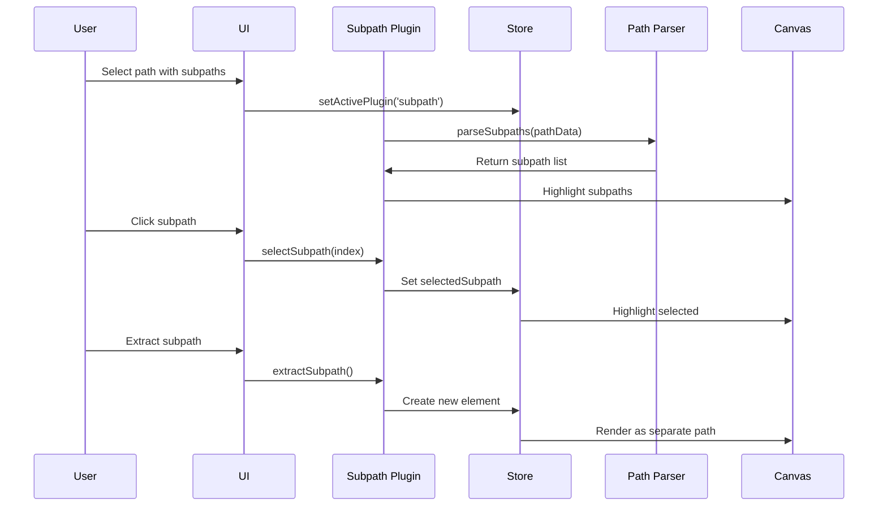

# Subpath Plugin

**Purpose**: Manage individual subpaths within complex paths

## Overview

- Select individual subpaths
- Multi-select subpaths (constrained to single element)
- Delete subpaths
- Reorder subpaths
- Align and distribute subpaths
- Split subpaths into separate paths
- Reverse subpath direction
- Join selected subpaths into a single subpath

## Plugin Interaction Flow



## Handler

## Handler

Select subpaths within paths

## Keyboard Shortcuts

| Key | Action |
| --- | ------ |
| `Delete` | Delete selected subpath(s) |

## UI Contributions

### Panels

- Subpath list, align/distribute controls

### Overlays

- **SubpathOverlay**: Visual rendering of individual subpaths with selection highlights and manipulation controls

### Canvas Layers

- Subpath highlights and selection indicators

## Public APIs

The Subpath plugin exposes the following public APIs:

### `performPathSimplify()`

Simplifies the current path by reducing the number of points while maintaining the shape.

**Usage**:
```typescript
const api = useCanvasStore.getState().getPluginApi('subpath');
api.performPathSimplify();
```

### `performSubPathReverse()`

Reverses the direction of the current subpath.

**Usage**:
```typescript
const api = useCanvasStore.getState().getPluginApi('subpath');
api.performSubPathReverse();
```

### `performSubPathJoin()`

Joins selected subpaths together into a single subpath (within their element) or joins eligible adjacent subpaths inside a path element.

**Usage**:
```typescript
const api = useCanvasStore.getState().getPluginApi('subpath');
api.performSubPathJoin();
```

## Usage Examples

```typescript
// Activate the plugin
const state = useCanvasStore.getState();
state.setMode('subpath');

// Access plugin state
const subpathState = useCanvasStore(state => state.subpath);
```


## Implementation Details

**Location**: `src/plugins/subpath/`

**Files**:
- `index.ts`: Plugin definition
- `slice.ts`: Zustand slice (if applicable)
- `*Panel.tsx`: UI panels (if applicable) (reused for expandable variant when needed)
- `*Overlay.tsx`: Overlays (if applicable)

## Edge Cases & Limitations

- Implementation-specific constraints
- Performance considerations for large datasets
- Browser compatibility notes (if any)

## Init Lifecycle

The Subpath plugin uses the **init** lifecycle method:

```typescript
init: (_context) => {
  return () => { };
},
```

Currently, the init method is a placeholder with no initialization or cleanup logic. This structure is in place for future enhancements that may require global setup when the plugin is registered.

## Sidebar Configuration

The Subpath plugin uses **declarative sidebar panels**:

```typescript
sidebarPanels: [
  {
    key: 'subpath-operations',
    condition: (ctx) => !ctx.isInSpecialPanelMode,
    component: SubPathOperationsPanel,
  },
]
```

The **SubPathOperationsPanel** automatically appears when:
- Not in a special panel mode
- Always visible (no plugin-specific condition)

**Panel Features:**
- Subpath list and management
- Align and distribute controls
- Reverse subpath direction
- Split subpaths into separate paths
- Join selectedsubpaths

## Context Menu Actions

The Subpath plugin contributes **context menu actions**:

```typescript
contextMenuActions: [
  {
    id: 'reverse-subpath',
    action: (context) => {
      if (context.type !== 'subpath') return null;
      return {
        id: 'reverse-subpath',
        label: 'Reverse Direction',
        icon: Undo,
        onClick: () => { /* reverses subpath */ }
      };
    }
  },
  // ... split and join actions for paths with multiple subpaths
]
```

**Available Actions:**
- **Reverse Direction** (subpath context): Reverses the drawing direction of the selected subpath
- **Subpath Split** (path context with multiple subpaths): Splits subpaths into separate path elements
- **Subpath Join** (path context with multiple subpaths): Joins selected subpaths into a single subpath

Actions are conditionally visible based on context (subpath vs path) and path structure (number of subpaths).

## Related

- [Plugin System Overview](../overview)
- [Event Bus](../../event-bus/overview)

## Expandable Panel Behavior

When the sidebar is unpinned and Subpath mode is active, the bottom expandable panel shows the transversal `EditorPanel` content (shared stroke/fill/opacity controls). This avoids duplicating Subpath-specific UI while still giving quick access to styling properties. The plugin registers:

```ts
export const subpathPlugin: PluginDefinition<CanvasStore> = {
    id: 'subpath',
    metadata: { label: 'Subpath', icon: NodeIcon },
    expandablePanel: EditorPanel, // Reuse universal panel
    // other properties...
};
```


