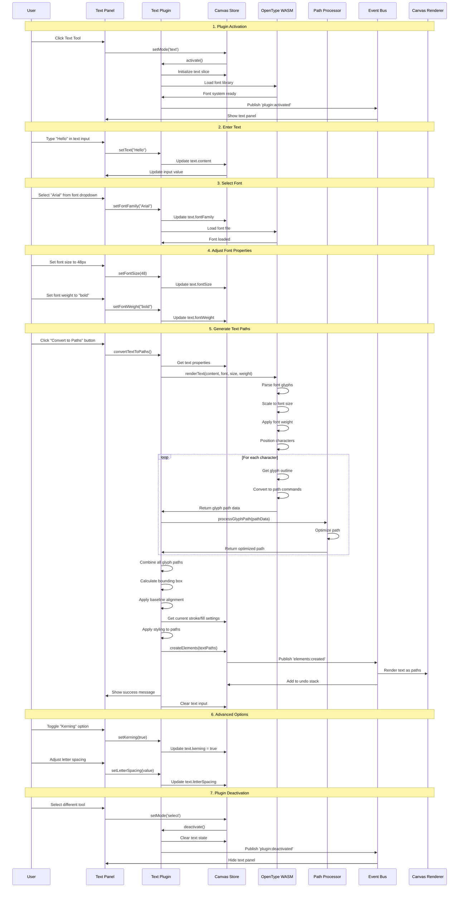
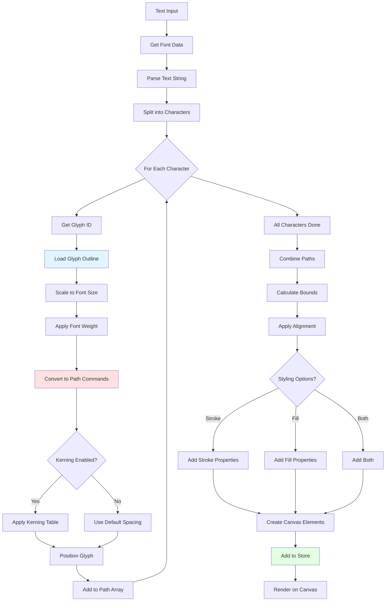
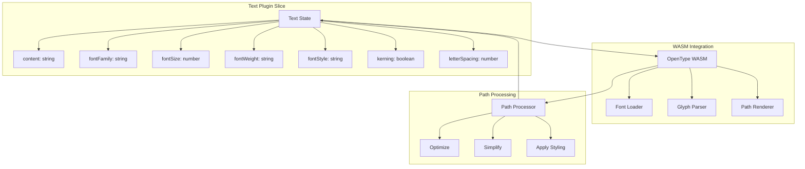

# Text Plugin

**Purpose**: Convert text to vector paths using font rendering

## Overview

- Text-to-curves conversion
- Font family, size, weight, style selection
- Uses WASM (potrace) for rendering
- Applies current stroke/fill settings

## Plugin Interaction Flow



## Text-to-Path Conversion



## State Management



## Handler

N/A (uses panel input)

## Keyboard Shortcuts

No plugin-specific shortcuts.

## UI Contributions

### Panels

- Text input, font selection, size, weight, style

### Overlays

No overlays.

### Canvas Layers

No canvas layers.

## Public APIs

No public APIs exposed.

## Usage Examples

```typescript
// Activate the plugin
const state = useCanvasStore.getState();
state.setMode('text');

// Access plugin state
const textState = useCanvasStore(state => state.text);
```


## Implementation Details

**Location**: `src/plugins/text/`

**Files**:
- `index.ts`: Plugin definition
- `slice.ts`: Zustand slice (if applicable)
- `*Panel.tsx`: UI panels (if applicable)
- `*Overlay.tsx`: Overlays (if applicable)

## Edge Cases & Limitations

- Implementation-specific constraints
- Performance considerations for large datasets
- Browser compatibility notes (if any)

## Related

- [Plugin System Overview](../overview)
- [Event Bus](../../event-bus/overview)


