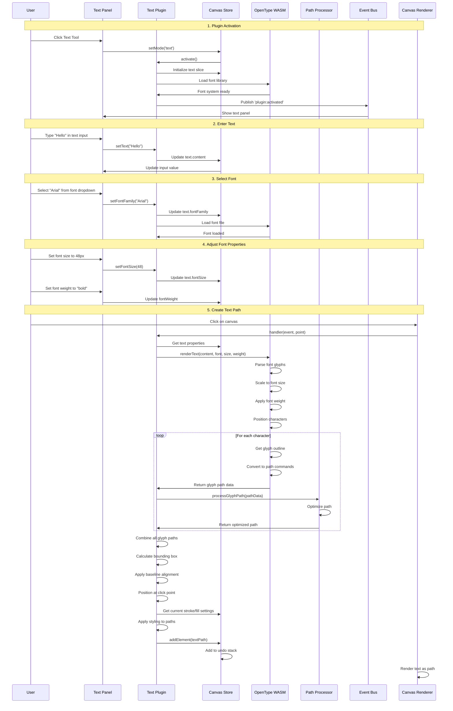
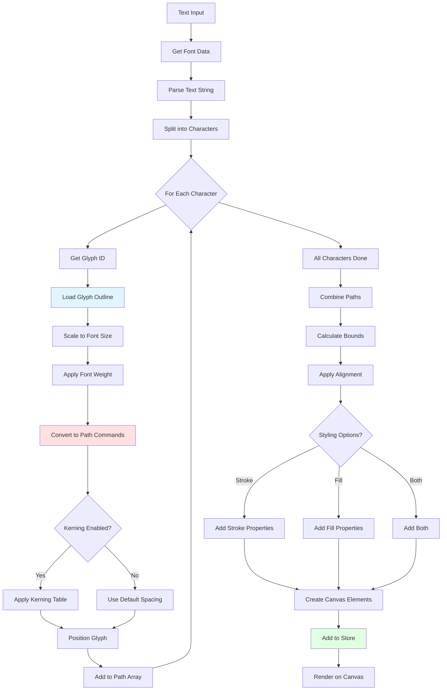
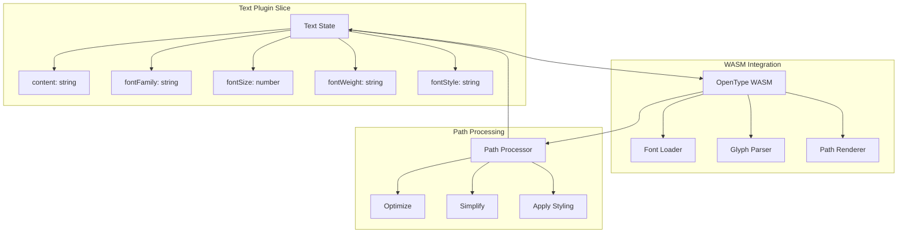

# Text Plugin

**Purpose**: Convert text to vector paths using font rendering

## Overview

- Text-to-curves conversion
- Font family, size, weight, style selection
- Uses WASM (potrace) for rendering
- Applies current stroke/fill settings

## Plugin Interaction Flow



## Text-to-Path Conversion



## State Management



## Handler

Responds to pointer events when text content is available and creates text paths on canvas click.

## Keyboard Shortcuts

| Key | Action |
|-----|--------|
| `Enter` | Reserved for text tool interactions (e.g., committing text input when editing) |

## UI Contributions

### Panels

- Text input, font selection (always-visible 5-row list), size, weight, style

### Overlays

No overlays.

### Canvas Layers

No canvas layers.

## Public APIs

No public APIs exposed.

## Usage Examples

```typescript
// Activate the plugin
const state = useCanvasStore.getState();
state.setMode('text');

// Access plugin state
const textState = useCanvasStore(state => state.text);
```


## Implementation Details

**Location**: `src/plugins/text/`

**Files**:
- `index.ts`: Plugin definition
- `slice.ts`: Zustand slice (if applicable)
- `*Panel.tsx`: UI panels (if applicable)
- `*Overlay.tsx`: Overlays (if applicable)

## Edge Cases & Limitations

### Canvas Size Constraints

The text vectorization process uses potrace-wasm for rendering, which has internal memory buffer limitations. To prevent "offset is out of bounds" errors, the system implements adaptive canvas sizing:

**Limits:**
- Maximum canvas width: 2048px
- Maximum canvas height: 768px
- Maximum total pixels: 1,500,000 (~1.5M)

**Adaptive Scaling:**
The system automatically calculates the optimal rendering scale (1x to 4x) based on:
1. Estimated text dimensions
2. All three constraint limits
3. Iterative adjustment to ensure canvas stays within bounds

**Behavior:**
- Short text: Renders at 4x scale for optimal quality
- Medium text: Automatically scales down to 2-3x
- Long text: Scales to 1x if necessary
- Extreme cases: Proportionally reduces dimensions to fit within pixel count limit

**Example:**
- Text "VectorNest" at 180px font size
- Estimate: 941×216px (203,256 pixels)
- With 4x scale: 3,764×864px = 3,251,296 pixels ❌ (exceeds 1.5M limit)
- System adjusts to 2x scale: 1,882×432px = 813,024 pixels ✅
- Result: Successful vectorization at acceptable quality

This ensures reliable text-to-path conversion regardless of text length or font size.

## Related

- [Plugin System Overview](../overview)
- [Event Bus](../../event-bus/overview)


