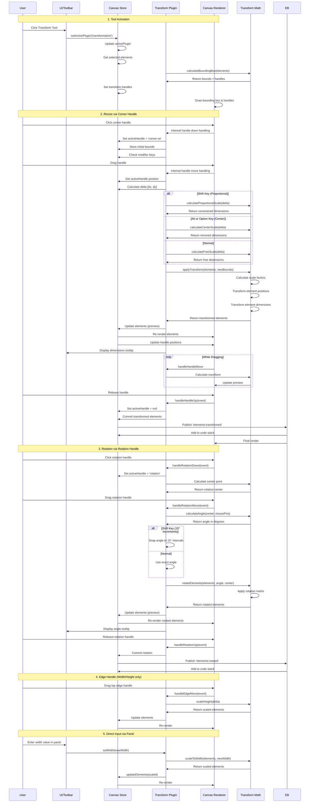
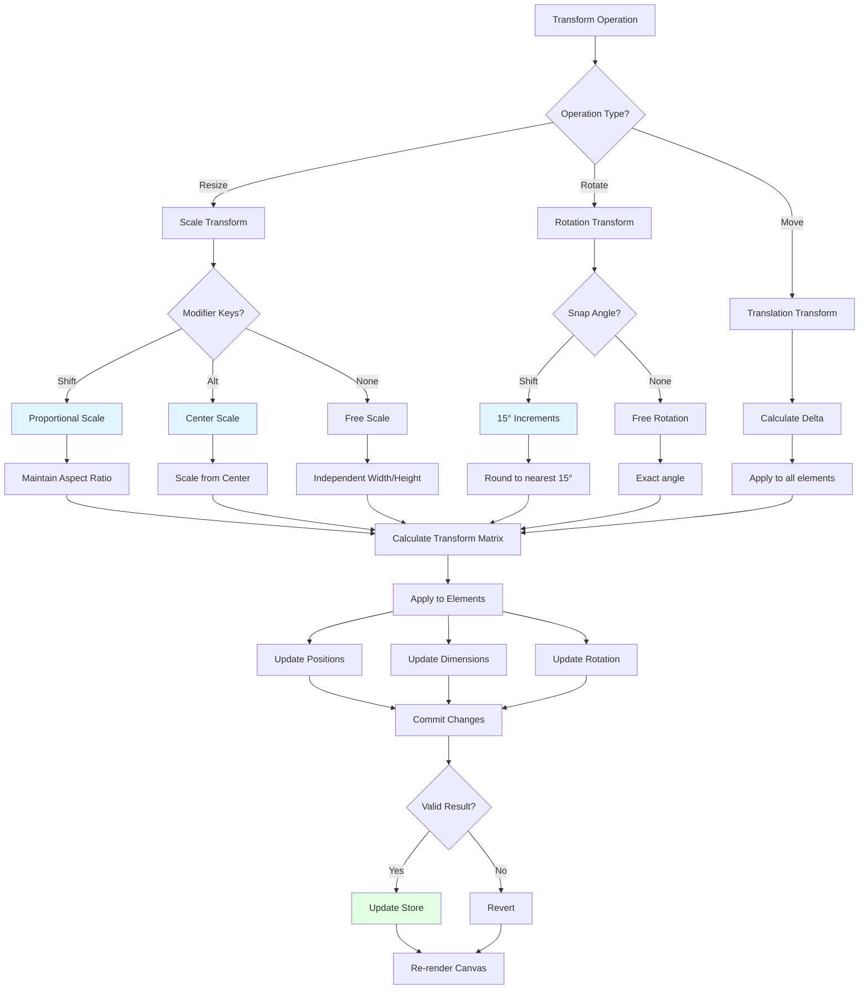
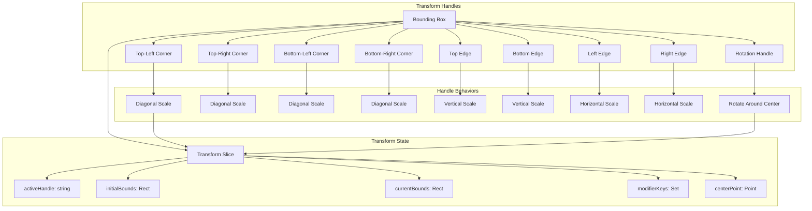

# Transformation Plugin

**Purpose**: Resize, rotate, and transform selected elements with visual handles

## Overview

The Transformation Plugin provides intuitive visual handles for resizing, rotating, and transforming selected elements on the canvas. It supports both proportional and free-form scaling, rotation with angle snapping, and real-time visual feedback during transformations.

**Key Features:**
- **8-handle bounding box**: Corner and edge handles for precise control
- **Rotation handle**: Circular handle above the bounding box
- **Visual feedback**: Real-time dimension and angle display
- **Proportional scaling**: Shift key for aspect ratio preservation
- **Center scaling**: Alt/Option key to scale from center
- **Angle snapping**: 15° increments when holding Shift during rotation
- **Visual rulers**: Optional coordinate display
- **Multi-element support**: Transform multiple selected elements together

**Transform Operations:**
- Resize (Scale) via 8 handles
- Rotate via rotation handle above bounding box
- Move (Translate) by dragging inside bounding box

## Plugin Interaction Flow



## Transform Math Operations



## Handle System



## Transform Operations

### Resize (Scale)

Drag any of the 8 handles on the bounding box to resize elements.

**Corner Handles (4):**
- Drag to scale both width and height
- Visual feedback shows current dimensions
- Hold **Shift** for proportional scaling (maintains aspect ratio)
- Hold **Alt/Option** to scale from center point

**Edge Handles (4):**
- **Top/Bottom**: Scale height only (width locked)
- **Left/Right**: Scale width only (height locked)
- No proportional constraint (independent axis scaling)

**Scale Limits:**
- Minimum scale: 0.05× (5% of original size)
- Maximum scale: 10× (1000% of original size)
- Prevents extreme or invalid transformations

### Rotate

Drag the circular rotation handle above the bounding box to rotate elements.

**Behavior:**
- Rotates around the center point of the bounding box
- Hold **Shift** to snap to 15° increments (0°, 15°, 30°, 45°, etc.)
- Visual angle indicator shows current rotation
- Full 360° rotation support (no limits)

**Angle Display:**
- Real-time tooltip shows angle in degrees
- Positive values: Clockwise rotation
- Negative values: Counter-clockwise rotation
- Wraps at ±180°

### Move (Translate)

Click and drag anywhere inside the bounding box (not on handles) to move elements.

**Behavior:**
- Maintains relative positions of all selected elements
- Works with single or multi-selection
- Respects grid snapping when enabled
- Real-time position feedback

---

## Transform Mathematics

### Scale Calculation

When a handle is dragged, the system calculates scale factors:

```typescript
// Corner handle scale (proportional with Shift)
const deltaX = currentPoint.x - dragStart.x;
const deltaY = currentPoint.y - dragStart.y;

const rawScaleX = (bounds.width + deltaX * signX) / bounds.width;
const rawScaleY = (bounds.height + deltaY * signY) / bounds.height;

if (isShiftPressed) {
  // Proportional: use minimum scale for both axes
  const scale = Math.min(Math.abs(rawScaleX), Math.abs(rawScaleY));
  scaleX = rawScaleX < 0 ? -scale : scale;
  scaleY = rawScaleY < 0 ? -scale : scale;
} else {
  scaleX = rawScaleX;
  scaleY = rawScaleY;
}

// Apply scale limits
scaleX = clamp(scaleX, -10, 10);
scaleY = clamp(scaleY, -10, 10);
```

### Rotation Calculation

```typescript
// Calculate angle from center to current point
const centerX = bounds.x + bounds.width / 2;
const centerY = bounds.y + bounds.height / 2;

const angle = Math.atan2(
  currentPoint.y - centerY,
  currentPoint.x - centerX
) * (180 / Math.PI);

if (isShiftPressed) {
  // Snap to 15° increments
  return Math.round(angle / 15) * 15;
}

return angle;
```

### Transform Matrix Application

```typescript
// Apply transformation to path commands
const transformedCommands = transformCommands(subPath, {
  scaleX,
  scaleY,
  originX,    // Transform origin point
  originY,
  rotation,   // In degrees
  rotationCenterX,
  rotationCenterY
});

// Scale stroke width proportionally
const scaledStrokeWidth = calculateScaledStrokeWidth(
  originalStrokeWidth,
  scaleX,
  scaleY
);
```

---

## Visual Feedback

### Dimension Display

During resize operations, a tooltip shows:
- **Current dimensions**: "Width × Height" in canvas units
- **Delta values**: "+X, +Y" showing change from original
- **Scale percentages**: "150% × 200%" relative to original size

### Angle Display

During rotation, a tooltip shows:
- **Current angle**: "45°" or "Rotation: 45°"
- **Snap indicator**: Highlights when snapped to 15° increment
- **Direction**: Visual arc showing rotation direction

### Handle Highlighting

- **Hover state**: Handle grows slightly and changes color
- **Active state**: Handle is highlighted while dragging
- **Cursor feedback**: Cursor changes based on handle type
  - Diagonal arrows for corner handles
  - Vertical/horizontal arrows for edge handles
  - Circular arrow for rotation handle

---

## Handler

N/A (uses direct manipulation of handles via overlay interactions)

## Keyboard Shortcuts

**Modifier Keys** (during transform operations):
- **Shift**: 
  - During resize: Maintain aspect ratio (proportional scaling)
  - During rotation: Snap to 15° increments
- **Alt/Option**: During resize: Scale from center point

No direct keyboard shortcuts for activation.

## UI Contributions

### Panels

**TransformationPanel**: Display and input controls for:
- Width and height values (direct input)
- Rotation angle (direct input)
- X and Y position coordinates
- Lock aspect ratio toggle
- Reset transform button
- Visual rulers toggle
- Corner coordinate labels toggle

### Overlays

**TransformationOverlay**: Complete visual transformation system including:
- **Bounding box**: Rectangle encompassing all selected elements
- **8 resize handles**: Corner handles (4) and edge handles (4)
- **Rotation handle**: Circular handle above bounding box
- **Center marker**: Visual indicator of rotation center
- **Measurement rulers**: Optional horizontal and vertical rulers with dimensions
- **Corner coordinate labels**: Optional position labels at corners
- **Real-time feedback**: Dimension tooltips during operations

### Canvas Layers

- Transform handles and bounding box (foreground layer)
- Measurement overlays (when enabled)

## Public APIs

The transformation plugin exposes methods through the Canvas Store:

```typescript
interface TransformationSlice {
  // State
  transformation: {
    isTransforming: boolean;
    activeHandle: string | null;
    initialBounds: Rect | null;
    currentBounds: Rect | null;
    modifierKeys: Set<string>;
    centerPoint: Point | null;
  };
  
  // Actions
  applyResizeTransform?: (width: number, height: number) => void;
  applyRotationTransform?: (degrees: number) => void;
  getTransformationBounds?: () => Rect | null;
  updateTransformationState?: (state: Partial<TransformState>) => void;
  isWorkingWithSubpaths?: () => boolean;
}
```

**Key Methods:**
- `applyResizeTransform(width, height)`: Apply resize transformation to selected elements
- `applyRotationTransform(degrees)`: Apply rotation transformation
- `getTransformationBounds()`: Get current transformation bounding box
- `isWorkingWithSubpaths()`: Check if transforming individual subpaths

## Usage Examples

### Activating the Transform Tool

```typescript
const state = useCanvasStore.getState();
state.setActivePlugin('transformation');
```

### Programmatic Transformations

```typescript
// Resize to specific dimensions
const state = useCanvasStore.getState();
state.applyResizeTransform?.(200, 150);

// Proportional resize to width
const bounds = state.getTransformationBounds?.();
if (bounds) {
  const aspectRatio = bounds.height / bounds.width;
  state.applyResizeTransform?.(200, 200 * aspectRatio);
}

// Rotate to specific angle
state.applyRotationTransform?.(45); // 45 degrees

// Rotate by relative amount
const currentRotation = element.data?.transform?.rotation || 0;
state.applyRotationTransform?.(currentRotation + 90);
```

### Subscribe to Transform State

```typescript
// React component: subscribe to transformation state
const transformation = useCanvasStore(state => state.transformation);
const isTransforming = transformation?.isTransforming ?? false;
const activeHandle = transformation?.activeHandle;

// Check before performing operations
if (isTransforming) {
  console.log('User is actively transforming elements');
}
```

### Working with Subpaths

```typescript
// Check if transforming individual subpaths
const isSubpathMode = state.isWorkingWithSubpaths?.();

if (isSubpathMode) {
  // Transform only the selected subpath
  console.log('Transforming individual subpath');
} else {
  // Transform entire elements
  console.log('Transforming complete elements');
}
```


## Implementation Details

**Location**: `src/plugins/transformation/`

**Files**:
- `index.tsx`: Plugin definition and canvas layer registration
- `slice.ts`: Zustand slice for transformation state
- `TransformationPanel.tsx`: UI panel with input controls
- `TransformationOverlay.tsx`: Main overlay component coordinating all visual elements
- `TransformationHandlers.tsx`: Handle interaction logic
- `MeasurementRulers.tsx`: Optional measurement ruler overlay
- `CornerCoordinateLabels.tsx`: Optional corner position labels
- `CenterMarker.tsx`: Rotation center visual indicator

**Key Components:**
- Transform handles use direct SVG manipulation for performance
- Real-time feedback computed during drag operations
- Transform operations applied to path commands (non-destructive)
- Stroke width scales proportionally with element

**Transform Controller:**
- Calculates bounding box for selected elements
- Handles 8 resize handles + 1 rotation handle
- Computes transform matrices and applies to path data
- Respects scale limits (0.05× to 10×)

## Edge Cases & Limitations

### Functional Limitations
- **Minimum selection**: Requires at least one element to be selected
- **Scale limits**: Prevents scaling below 5% or above 1000% (0.05× to 10×)
- **Angle wrapping**: Rotation angle wraps at ±180° (expected behavior)
- **Stroke scaling**: Stroke width scales with element (may become too thick/thin)
- **Subpath mode**: When transforming individual subpaths, only selected subpath is affected

### Visual Constraints
- **Viewport zoom**: Handles may be too small/large at extreme zoom levels
- **Edge handles**: Do not support proportional scaling (by design)
- **Center marker**: Only visible during rotation operations

### Performance Considerations
- Transform calculations are real-time (may impact performance with many elements)
- Complex paths with many commands may transform slower
- Preview updates on every pointer move event

### Browser Compatibility
- Requires modern browser with Canvas API and SVG support
- No known compatibility issues with modern browsers

## Related

- [Plugin System Overview](../overview)
- [Selection Feature](../../features/selection) - Element selection required for transforms
- [Canvas Store API](../../api/canvas-store) - Transformation slice methods
