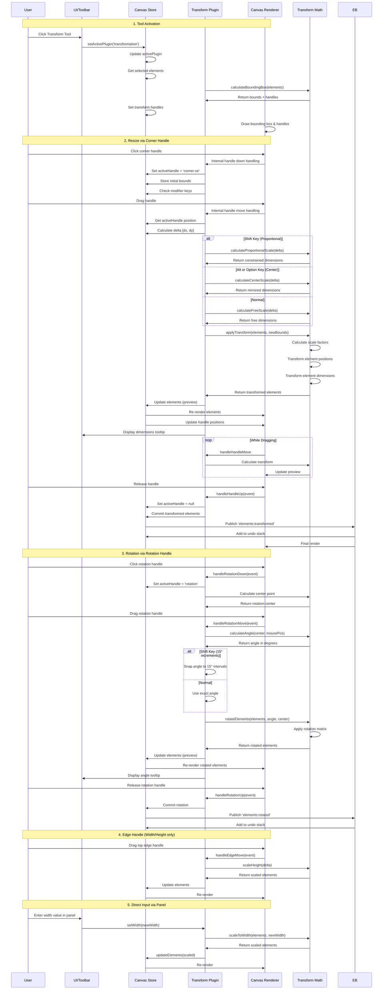
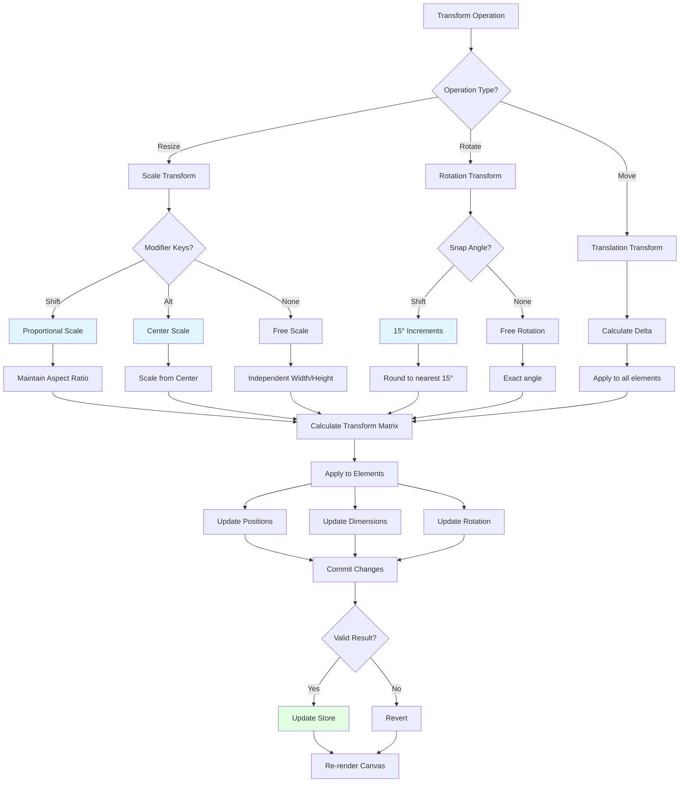
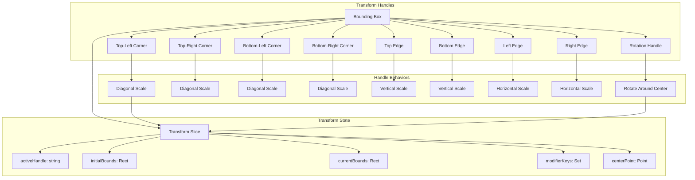

# Transformation Plugin

**Purpose**: Resize, rotate, and transform selected elements

## Overview

- Bounding box with resize handles
- Proportional scaling (Shift key)
- Center scaling (Alt/Option key)
- Rotation handle
- Visual rulers and coordinate display

## Plugin Interaction Flow



## Transform Math Operations



## Handle System



## Handler

N/A (uses direct manipulation of handles)

## Keyboard Shortcuts

No plugin-specific shortcuts.

## UI Contributions

### Panels

- Transform options, rulers, coordinates

### Overlays

- **TransformationOverlay**: Visual rendering of transformation handles, bounding box, and real-time transform feedback

### Canvas Layers

- Transform handles and bounding box

## Public APIs

No public APIs exposed.

## Usage Examples

```typescript
// Activate the plugin
const state = useCanvasStore.getState();
state.setMode('transformation');

// Access plugin state
const transformationState = useCanvasStore(state => state.transformation);
```


## Implementation Details

**Location**: `src/plugins/transformation/`

**Files**:
- `index.ts`: Plugin definition
- `slice.ts`: Zustand slice (if applicable)
- `*Panel.tsx`: UI panels (if applicable)
- `*Overlay.tsx`: Overlays (if applicable)

## Edge Cases & Limitations

- Implementation-specific constraints
- Performance considerations for large datasets
- Browser compatibility notes (if any)

## Related

- [Plugin System Overview](../overview)
- [Event Bus](../../event-bus/overview)

- [Transform Feature](../../features/transforms)
