# Transformation Plugin

**Purpose**: Resize, rotate, and transform selected elements with visual handles

## Overview

The Transformation Plugin provides intuitive visual handles for resizing, rotating, and transforming selected elements on the canvas. It operates as a dedicated mode that must be explicitly activated by the user, ensuring intentional transformations and preventing accidental modifications.

**Key Features:**
- **Explicit activation**: Transformation mode must be activated via the toolbar button
- **8-handle bounding box**: Corner and edge handles for precise control
- **Rotation handle**: Circular handle above the bounding box
- **Visual feedback**: Real-time dimension and angle display
- **Proportional scaling**: Shift key for aspect ratio preservation
- **Angle snapping**: 15° increments when holding Shift during rotation
- **Visual rulers**: Optional coordinate display
- **Multi-element support**: Transform single paths, groups, or multiple selected elements together
- **Integrated panel controls**: Direct input for width, height, and rotation values

**Activation Requirements:**
- **Single path**: Transformation mode enabled when one path is selected
- **Single group**: Transformation mode enabled when one group is selected
- **Multi-selection**: Transformation mode enabled when 2+ elements are selected (paths or groups)

**Transform Operations:**
- Resize (Scale) via 8 handles or panel inputs
- Rotate via rotation handle or panel input
- Move (Translate) by dragging inside bounding box

## Plugin Interaction Flow


## Transform Math Operations

```mermaid
flowchart TD
    A[Transform Operation] --> B{Operation Type?}
    
    B -->|Resize| C[Scale Transform]
    B -->|Rotate| D[Rotation Transform]
    B -->|Move| E[Translation Transform]
    
    C --> C1{Modifier Keys?}
    C1 -->|Shift| C2[Proportional Scale]
    C1 -->|Alt| C3[Center Scale]
    C1 -->|None| C4[Free Scale]
    
    C2 --> F1[Maintain Aspect Ratio]
    C3 --> F2[Scale from Center]
    C4 --> F3[Independent Width/Height]
    
    D --> D1{Snap Angle?}
    D1 -->|Shift| D2[15° Increments]
    D1 -->|None| D3[Free Rotation]
    
    D2 --> G1[Round to nearest 15°]
    D3 --> G2[Exact angle]
    
    E --> E1[Calculate Delta]
    E1 --> E2[Apply to all elements]
    
    F1 --> H[Calculate Transform Matrix]
    F2 --> H
    F3 --> H
    G1 --> H
    G2 --> H
    E2 --> H
    
    H --> I[Apply to Elements]
    I --> J[Update Positions]
    I --> K[Update Dimensions]
    I --> L[Update Rotation]
    
    J --> M[Commit Changes]
    K --> M
    L --> M
    
    M --> N{Valid Result?}
    N -->|Yes| O[Update Store]
    N -->|No| P[Revert]
    
    O --> Q[Re-render Canvas]
    P --> Q
    
    style C2 fill:#e1f5ff
    style C3 fill:#e1f5ff
    style D2 fill:#e1f5ff
    style O fill:#e1ffe1
```



## Handle System


## Transform Operations

### Resize (Scale)

Drag any of the 8 handles on the bounding box to resize elements.

**Corner Handles (4):**
- Drag to scale both width and height
- Visual feedback shows current dimensions
- Hold **Shift** for proportional scaling (maintains aspect ratio)
- Hold **Alt/Option** to scale from center point

**Edge Handles (4):**
- **Top/Bottom**: Scale height only (width locked)
- **Left/Right**: Scale width only (height locked)
- No proportional constraint (independent axis scaling)

**Scale Limits:**
- Minimum scale: 0.05× (5% of original size)
- Maximum scale: 10× (1000% of original size)
- Prevents extreme or invalid transformations

### Rotate

Drag the circular rotation handle above the bounding box to rotate elements.

**Behavior:**
- Rotates around the center point of the bounding box
- Hold **Shift** to snap to 15° increments (0°, 15°, 30°, 45°, etc.)
- Visual angle indicator shows current rotation
- Full 360° rotation support (no limits)

**Angle Display:**
- Real-time tooltip shows angle in degrees
- Positive values: Clockwise rotation
- Negative values: Counter-clockwise rotation
- Wraps at ±180°

### Move (Translate)

Click and drag anywhere inside the bounding box (not on handles) to move elements.

**Behavior:**
- Maintains relative positions of all selected elements
- Works with single or multi-selection
- Respects grid snapping when enabled
- Real-time position feedback

---

## Advanced Transformations

The Transformation Plugin includes an **Advanced Mode** that unlocks sophisticated transformation capabilities beyond standard resize and rotate operations. This mode provides three specialized transformation types: **Distort**, **Skew**, and **Perspective**.

### Activating Advanced Mode

**Checkbox in Transformation Panel:**
1. Select one or more elements
2. Activate transformation mode via toolbar
3. In the Transformation Panel, enable the **"Advanced"** checkbox
4. Visual handlers change to show specialized advanced handles

**Advanced Mode Features:**
- **8 specialized handles**: 4 corner handles + 4 edge handles with modified behaviors
- **Modifier key support**: Cmd/Alt keys enable perspective transformations
- **Real-time preview**: All transformations show live preview during drag
- **Console logging**: Debug logs show transformation mode being applied (Distort/Skew/Perspective)
- **Original state preservation**: Transformations apply from original element state to prevent accumulation

### Advanced Transformation Types

#### 1. Distort (Corner Handles)

Free-form corner manipulation allowing independent movement of each corner.

**Handles**: 4 circular handles at each corner
**Interaction**: Drag any corner handle independently
**Use Cases**: 
- Creating perspective illusions
- Adjusting shapes to fit within boundaries
- Custom shape distortions

**How to Use:**
1. Activate "Advanced" mode in Transformation Panel
2. Drag any **corner handle** (top-left, top-right, bottom-left, or bottom-right)
3. The selected corner moves freely while other corners remain fixed
4. Release to apply the distortion

**Visual Feedback:**
- Dashed bounding box showing the transformation area
- Console log: `🔷 Advanced Transform Mode: DISTORT (corner)`
- Console log during drag: `🔷 Applying DISTORT: [corner-name] corner`

**Technical Details:**
- Uses perspective matrix transformation via `createPerspectiveMatrix()`
- Applies transformation to all path commands (M, L, C, Z)
- Handles groups recursively (all descendants are distorted)
- Works with paths, subpaths, groups, and multi-selection

#### 2. Skew (Edge Handles)

Parallel edge movement creating shear transformations along X or Y axis.

**Handles**: 4 circular handles at the center of each edge
**Interaction**: Drag edge handles (top, bottom, left, right)
**Use Cases**:
- Creating italic/slanted effects
- Perspective adjustments
- Shear transformations

**How to Use:**
1. Activate "Advanced" mode in Transformation Panel
2. Drag an **edge handle**:
   - **Top/Bottom edges**: Creates horizontal skew (X-axis shear)
   - **Left/Right edges**: Creates vertical skew (Y-axis shear)
3. Release to apply the skew

**Visual Feedback:**
- Dashed bounding box showing the transformation area
- Console log: `🔷 Advanced Transform Mode: SKEW { axis: 'x' | 'y' }`
- Console log during drag: `🔷 Applying SKEW: { axis: 'x' | 'y', angle: '15.23' }`

**Skew Limits:**
- Angle range: -75° to +75° (prevents extreme distortions)
- Calculated dynamically based on drag distance and element size

**Technical Details:**
- Uses `applySkewXTransform()` for horizontal skew (top/bottom edges)
- Uses `applySkewYTransform()` for vertical skew (left/right edges)
- Angle calculated via `calculateSkewAngleFromDelta(delta, perpDistance)`
- Applies trigonometric transformations to path coordinates

#### 3. Perspective (Edge Handles + Modifier Key)

Edge-based perspective transformation that moves both corners of an edge simultaneously, creating depth effects.

**Handles**: Same 4 edge handles as Skew mode
**Interaction**: Drag edge handle **while holding Cmd (Mac) or Alt (Windows)**
**Use Cases**:
- Creating depth and 3D perspective effects
- Simulating viewing angles
- Architectural distortions

**How to Use:**
1. Activate "Advanced" mode in Transformation Panel
2. **Press and hold** Cmd (Mac) or Alt (Windows)
3. Drag an **edge handle**:
   - **Top edge**: Moves both top-left and top-right corners together
   - **Bottom edge**: Moves both bottom-left and bottom-right corners together
   - **Left edge**: Moves both top-left and bottom-left corners together
   - **Right edge**: Moves both top-right and bottom-right corners together
4. Release mouse, then release modifier key

**Visual Feedback:**
- Dashed bounding box showing the transformation area
- Console log: `🔷 Advanced Transform Mode: PERSPECTIVE (edge + modifier)`
- Console log during drag: `🔷 Applying PERSPECTIVE: [edge-name] edge (both corners)`

**Technical Details:**
- Detection: Mode determined at `startAdvancedTransformation()` based on modifier key state
- Edge-to-corner mapping:
  - `advanced-edge-top` → moves `tl` and `tr` corners
  - `advanced-edge-bottom` → moves `bl` and `br` corners
  - `advanced-edge-left` → moves `tl` and `bl` corners
  - `advanced-edge-right` → moves `tr` and `br` corners
- Uses same distort transformation as corner mode but with paired corner movement
- Applies perspective matrix transformation

### Advanced Mode Interaction Flow


### Advanced Mode Technical Implementation

**State Management:**
```typescript
interface AdvancedTransformState {
  isTransforming: boolean;
  transformType: 'distort' | 'skew' | null;
  handler: string | null; // e.g., 'advanced-corner-tl', 'advanced-edge-top'
  startPoint: Point | null;
  originalBounds: { minX, minY, maxX, maxY } | null;
  corners: { tl, tr, bl, br } | null;
  skewAxis: 'x' | 'y' | null;
  originalElements: Map<string, CanvasElement> | null;
}
```

**Transform Functions:**
- `applyAdvancedDistortTransform(newCorners)`: Applies perspective distortion using 4-point transformation matrix
- `applyAdvancedSkewTransform(axis, angle)`: Applies shear transformation along specified axis
- `createPerspectiveMatrix(srcCorners, dstCorners)`: Generates 3x3 transformation matrix
- `calculateSkewAngleFromDelta(delta, perpDistance)`: Converts mouse movement to skew angle

**Original State Preservation:**
```typescript
// On start: Deep clone all affected elements
const originalElements = new Map<string, CanvasElement>();
selectedElements.forEach(element => {
  originalElements.set(element.id, JSON.parse(JSON.stringify(element)));
  // Also clone descendants if element is a group
});

// On each update: Restore original, then apply new transformation
originalElements.forEach((originalElement, elementId) => {
  updateElement(elementId, { data: originalElement.data });
});
// Then apply transformation from original state
applyTransformation(...);
```

**Mode Detection Logic:**
```typescript
// At pointer down
if (handler.startsWith('advanced-edge-')) {
  if (isModifierPressed) {
    transformType = 'distort'; // Perspective
  } else {
    transformType = 'skew';
    skewAxis = handler.includes('top') || handler.includes('bottom') ? 'x' : 'y';
  }
} else if (handler.startsWith('advanced-corner-')) {
  transformType = 'distort';
}
```

### Debugging Advanced Transformations

The Advanced Mode includes comprehensive console logging for debugging and understanding the transformation flow:

**Console Log Indicators:**
- 🔷 `Advanced Transform Mode: DISTORT (corner)` - Corner handle selected
- 🔷 `Advanced Transform Mode: SKEW { axis: 'x' }` - Edge handle without modifier
- 🔷 `Advanced Transform Mode: PERSPECTIVE (edge + modifier)` - Edge handle with Cmd/Alt
- 🔷 `Applying DISTORT: top-left corner` - Active distortion being applied
- 🔷 `Applying SKEW: { axis: 'y', angle: '23.45' }` - Active skew with calculated angle
- 🔷 `Applying PERSPECTIVE: left edge (both corners)` - Active perspective transformation

**How to Debug:**
1. Open browser developer console (F12)
2. Enable Advanced mode and interact with handles
3. Watch console logs to verify correct transformation mode
4. Check angle values and corner movements in real-time

### Advanced Mode Limitations

**Functional Constraints:**
- **Skew angle limit**: Restricted to ±75° to prevent extreme distortions
- **Modifier key timing**: For perspective, modifier must be pressed **before** dragging edge handle
- **Original state dependency**: Each transformation requires original element state to be preserved
- **No undo during drag**: Transformations are previewed but only committed on pointer up

**Performance Considerations:**
- Complex paths with many commands may transform slower in advanced mode
- Perspective transformations require matrix calculations (more computationally expensive)
- Real-time preview updates on every pointer move event

**Visual Limitations:**
- Advanced handles may overlap at small element sizes
- Extreme distortions can create invalid path geometries
- Stroke width does not scale with advanced transformations (by design)

### Supported Element Types

Advanced transformations work with all standard element types:
- ✅ **Paths**: Individual path elements
- ✅ **Subpaths**: Selected subpath segments within a path
- ✅ **Groups**: All descendants transformed recursively
- ✅ **Multi-selection**: Multiple elements transformed together

**Group Behavior:**
- When transforming a group, all descendants (nested groups and paths) are transformed
- Original state tracked for each descendant element
- Group structure preserved after transformation

**Subpath Behavior:**
- Only the selected subpath is transformed
- Other subpaths within the same path remain unchanged
- Subpath bounds calculated independently

---

## Group and Multi-Selection Transformations

The transformation plugin supports specialized handlers for groups and multi-selection scenarios, allowing you to resize and rotate multiple elements or entire groups as a single unit. **These handlers only appear when transformation mode is explicitly activated.**

### Activation and Mode Behavior

**Transformation Mode Activation:**
- Transformation mode is enabled in the toolbar when valid selections are present:
  - Single path selected
  - Single group selected  
  - Multiple elements (2+) selected
- Users must explicitly click the transformation tool button to enter transformation mode
- Handlers appear only in transformation mode, never in select mode

**Visual Feedback:**
- **Select Mode**: Shows only selection feedback (bounding boxes without handles)
  - Cyan bounding box for groups
  - Amber bounding box for multi-selection
  - Blue bounding box for individual paths
- **Transformation Mode**: Shows interactive transformation handlers
  - Replaces feedback-only bounding boxes with full handler controls for the selected element(s)
  - Handlers include 8 resize handles (corners + edges) and 1 rotation handle
  - **Context feedback**: When transforming a single path that belongs to groups, parent group boundaries are shown as cyan feedback boxes (without handlers) to provide visual context of the group hierarchy

### Multi-Selection Transformation

When two or more elements are selected that do not all belong to the same parent group, amber-colored transformation handlers are displayed in transformation mode.

**Features:**
- **Amber-colored handlers**: Distinct visual indication for multi-selection (#f59e0b)
- **Resize all elements**: All selected elements scale proportionally from the anchor point (opposite corner/edge)
- **Rotate all elements**: All selected elements rotate around the combined center point
- **Recursive group handling**: If any selected element is a group, all its descendants are also transformed
- **Transform from original state**: Each transformation is applied from the original element state, preventing accumulation errors
- **Fixed anchor scaling**: When dragging a corner, the opposite corner stays fixed; when dragging an edge, the opposite edge stays fixed

**Visual Indicators:**
- Amber transformation handles (8 resize + 1 rotation)
- Combined bounding box encompassing all selected elements
- Center marker showing the rotation pivot point
- Optional measurement rulers and coordinate labels
- Only visible in transformation mode (not in select mode)

**Note:** If all selected elements belong to the same parent group, cyan group handlers are shown instead (see Group Transformation).

### Group Transformation

When a single group is selected, or when multiple elements that all belong to the same parent group are selected, cyan-colored transformation handlers are displayed in transformation mode.

**Features:**
- **Cyan-colored handlers**: Distinct visual indication for groups (#22d3ee)
- **Resize entire group**: All descendant elements scale proportionally
- **Rotate entire group**: All descendant elements rotate around the group's center
- **Recursive descendant transformation**: All nested groups and paths are transformed
- **Preserves group structure**: Group hierarchy remains intact during transformation
- **Smart selection detection**: Automatically shows group handlers when all selected elements belong to the same parent group

**Visual Indicators:**
- Cyan transformation handles (8 resize + 1 rotation)
- Group bounding box calculated from all descendants (with 8px padding)
- Center marker showing the rotation pivot point
- Optional measurement rulers and coordinate labels
- Only visible in transformation mode (not in select mode)

### Priority System

The transformation overlay system follows a priority hierarchy to determine which handlers to display **when transformation mode is active**:

1. **All elements from same group** (highest priority): When multiple elements are selected and all belong to the same parent group, show cyan group handlers for the parent group
2. **Multi-selection** (high priority): When 2+ elements are selected but not all from the same group, show amber multi-selection handlers
3. **Single group**: When only 1 group is selected, show cyan group handlers
4. **Single path** (lowest priority): When only 1 path is selected, show default transformation handlers

This ensures that the most appropriate transformation interface is always displayed based on the current selection context.

**Mode-Based Display:**
- **Select Mode**: Shows only visual feedback (bounding boxes) without interactive handlers
  - Users see cyan boxes around selected groups
  - Users see amber boxes around multi-selection
  - Users see blue boxes around individual paths
- **Transformation Mode**: Shows interactive handlers with full transformation controls
  - All feedback bounding boxes are replaced by handler overlays for the primary selection
  - Users can resize, rotate, and manipulate selections
  - Panel controls become active for direct value input
  - **Context preservation**: When transforming individual paths within groups, parent group boundaries remain visible as cyan feedback boxes to maintain visual context of the group hierarchy

### Group Hierarchy Context

When transforming individual paths that belong to groups, the system provides visual context by displaying parent group boundaries as feedback-only cyan boxes (without interactive handlers). This behavior mirrors the visual feedback shown in select mode and helps users understand the group structure during transformations.

**Context Feedback Rules:**
- **Single path in group**: Shows cyan feedback boxes for all ancestor groups (parent, grandparent, etc.)
- **Single path in nested groups**: Displays feedback for the entire group hierarchy chain
- **Multiple paths**: Only shows handlers for the primary selection type (no additional context feedback)
- **Group transformations**: No additional context feedback needed (group handlers provide full context)

**Example Hierarchy Visualization:**
```
Root Group (feedback: cyan □)
  └─ Parent Group (feedback: cyan □)
      └─ Child Path (handlers: blue ⊞)
```

This ensures users maintain spatial awareness of group relationships while performing precise transformations on individual elements.

### Technical Implementation

**Pseudo-Element Creation:**
- For groups and multi-selection, the system creates temporary "pseudo-elements" with rectangular paths
- These pseudo-elements serve as transformation targets in the TransformController
- The rectangular path is based on the calculated bounds: `[M, L, L, L, Z]` commands

**Original State Tracking:**
- When transformation starts, the original state of all affected elements is stored in a `Map<string, CanvasElement>`
- During transformation updates, changes are calculated and applied from the original state
- This prevents transformation accumulation (e.g., scale(1.1) × scale(1.1) = scale(1.21))

**Transform Application:**
- Scale and rotation are applied from the anchor point (opposite corner/edge) not from center
- For corner handles: the opposite corner remains fixed during scaling
- For edge handles: the opposite edge remains fixed during scaling
- Transform origin is calculated based on the handler being dragged
- For groups, transformations recursively apply to all descendants
- Each frame applies the full transformation from original state, not incremental changes

**Canvas Layer Integration:**
- Handlers are rendered in the "selection-transformation-handlers" canvas layer
- This layer is part of the transformation plugin's foreground placement
- Handlers are only visible in TRANSFORMATION mode (not in select mode)
- Selection feedback (bounding boxes) remain visible in select mode

**Handler Padding:**
- Group handlers use 8px padding to match the group selection feedback visual
- Multi-selection handlers use 10px padding for visual distinction
- Individual path handlers use 5px padding for tighter control

**Workflow:**
1. **Select elements** in select mode (see feedback bounding boxes)
2. **Activate transformation mode** via toolbar button (button enabled when valid selection exists)
3. **Transform using handlers** or panel controls (feedback replaced by interactive handlers)
4. **Return to select mode** when transformation is complete (handlers hide, feedback reappears)

### Usage Example

```typescript
// Select multiple elements
const state = useCanvasStore.getState();
state.setSelectedIds(['element1', 'element2', 'element3']);

// Amber multi-selection handlers appear automatically
// User can drag corner handles to resize all elements
// User can drag rotation handle to rotate all elements around center

// Select a single group
state.setSelectedIds(['group1']);

// Cyan group handlers appear automatically
// User can resize/rotate the entire group
```

---

## Transform Mathematics

### Scale Calculation

When a handle is dragged, the system calculates scale factors:

```typescript
// Corner handle scale (proportional with Shift)
const deltaX = currentPoint.x - dragStart.x;
const deltaY = currentPoint.y - dragStart.y;

const rawScaleX = (bounds.width + deltaX * signX) / bounds.width;
const rawScaleY = (bounds.height + deltaY * signY) / bounds.height;

if (isShiftPressed) {
  // Proportional: use minimum scale for both axes
  const scale = Math.min(Math.abs(rawScaleX), Math.abs(rawScaleY));
  scaleX = rawScaleX < 0 ? -scale : scale;
  scaleY = rawScaleY < 0 ? -scale : scale;
} else {
  scaleX = rawScaleX;
  scaleY = rawScaleY;
}

// Apply scale limits
scaleX = clamp(scaleX, -10, 10);
scaleY = clamp(scaleY, -10, 10);
```

### Rotation Calculation

```typescript
// Calculate angle from center to current point
const centerX = bounds.x + bounds.width / 2;
const centerY = bounds.y + bounds.height / 2;

const angle = Math.atan2(
  currentPoint.y - centerY,
  currentPoint.x - centerX
) * (180 / Math.PI);

if (isShiftPressed) {
  // Snap to 15° increments
  return Math.round(angle / 15) * 15;
}

return angle;
```

### Transform Matrix Application

```typescript
// Apply transformation to path commands
const transformedCommands = transformCommands(subPath, {
  scaleX,
  scaleY,
  originX,    // Transform origin point
  originY,
  rotation,   // In degrees
  rotationCenterX,
  rotationCenterY
});

// Scale stroke width proportionally
const scaledStrokeWidth = calculateScaledStrokeWidth(
  originalStrokeWidth,
  scaleX,
  scaleY
);
```

---

## Transformation Panel

The Transformation Panel provides direct input controls for precise transformations, complementing the visual handlers. The panel is active whenever transformation mode is enabled and works seamlessly with all selection types.

**Panel Features:**
- **Width/Height Inputs**: Direct numeric input for exact dimensions
- **Rotation Input**: Precise angle control in degrees
- **Aspect Ratio Lock**: Toggle to maintain proportions during resize
- **Visual Toggles**: Show/hide rulers and coordinate labels
- **Real-time Updates**: Values update as transformations are applied via handlers

**Supported Selection Types:**
- **Single Path**: Panel displays and controls the path's transformation bounds
- **Single Group**: Panel calculates and controls transformation for entire group
- **Multi-Selection**: Panel operates on the combined bounding box of all selected elements

**Panel Controls:**

1. **Dimension Controls**:
   - Width input (numeric, updates in real-time)
   - Height input (numeric, updates in real-time)
   - Lock icon to toggle aspect ratio preservation
   - Values reflect the bounding box dimensions

2. **Rotation Control**:
   - Angle input (0-360 degrees)
   - Applies rotation around the center point
   - Works with all selection types

3. **Advanced Mode**:
   - "Advanced" checkbox: Enables advanced transformation modes (Distort, Skew, Perspective)
   - Changes visual handlers to specialized advanced handles
   - See [Advanced Transformations](#advanced-transformations) section for details

4. **Visual Aids**:
   - "Show Coordinates" toggle: Displays corner position labels
   - "Show Rulers" toggle: Displays measurement rulers with dimensions
   - Both toggles persist during the transformation session

**Workflow Integration:**
```typescript
// User enters transformation mode
state.setActivePlugin('transformation');

// Panel becomes active and displays current bounds
const bounds = state.getTransformationBounds();
// Returns: { minX, minY, maxX, maxY }

// User enters new width value
state.applyResizeTransform(newWidth, currentHeight);
// Applies to all selected elements from their original state

// User enters rotation value
state.applyRotationTransform(45);
// Rotates all selected elements around center
```

**Calculation Modes:**

- **Single Path**: Direct measurement from path commands
- **Single Group**: Recursive calculation including all descendants
- **Multi-Selection**: Combined bounds of all selected elements (paths and groups)

All transformations applied via the panel use the same origin-based scaling as the handlers, ensuring consistent behavior.

---

## Visual Feedback

### Dimension Display

During resize operations, a tooltip shows:
- **Current dimensions**: "Width × Height" in canvas units
- **Delta values**: "+X, +Y" showing change from original
- **Scale percentages**: "150% × 200%" relative to original size

### Angle Display

During rotation, a tooltip shows:
- **Current angle**: "45°" or "Rotation: 45°"
- **Snap indicator**: Highlights when snapped to 15° increment
- **Direction**: Visual arc showing rotation direction

### Handle Highlighting

- **Hover state**: Handle grows slightly and changes color
- **Active state**: Handle is highlighted while dragging
- **Cursor feedback**: Cursor changes based on handle type
  - Diagonal arrows for corner handles
  - Vertical/horizontal arrows for edge handles
  - Circular arrow for rotation handle

---

## Handler

N/A (uses direct manipulation of handles via overlay interactions)

## Keyboard Shortcuts

**Modifier Keys** (during transform operations):
- **Shift**: 
  - During resize: Maintain aspect ratio (proportional scaling)
  - During rotation: Snap to 15° increments
- **Alt/Option**: During resize: Scale from center point

No direct keyboard shortcuts for activation.

## UI Contributions

### Toolbar

**Transformation Button**: Tool activation button in top action bar
- **Enabled when**:
  - One or more paths selected
  - One or more groups selected
  - Any combination of 2+ elements selected
- **Disabled when**: No elements selected
- **Behavior**: Activates transformation mode, showing handlers and enabling panel controls

### Panels

**TransformationPanel**: Active when transformation mode is enabled, provides:
- **Dimension inputs**: Width and height with real-time updates
- **Rotation input**: Angle control (0-360 degrees)
- **Aspect ratio lock**: Toggle to maintain proportions
- **Visual aids toggles**: Show/hide rulers and coordinate labels
- **Works with**: Single paths, single groups, and multi-selection

**Features**:
- Direct numeric input for precise transformations
- Live updates as handlers are dragged
- Maintains aspect ratio when lock is enabled
- Applies transformations from original element state

### Overlays

**TransformationOverlay** (for single paths and subpaths):
- **Bounding box**: Rectangle encompassing the selected path
- **8 resize handles**: Corner handles (4) and edge handles (4)
- **Rotation handle**: Circular handle above bounding box
- **Center marker**: Visual indicator of rotation center
- **Measurement rulers**: Optional rulers with dimensions
- **Corner coordinate labels**: Optional position labels

**GroupTransformationOverlay** (for single groups):
- Cyan-colored handlers (8 resize + 1 rotation)
- Calculated bounds including all descendants
- Same controls as path transformation
- 8px padding to match group selection feedback

**SelectionBboxTransformationOverlay** (for multi-selection):
- Amber-colored handlers (8 resize + 1 rotation)
- Combined bounds of all selected elements
- Same controls as other transformations
- 10px padding for visual distinction

**Common Features**:
- All overlays only visible in transformation mode
- Real-time feedback during operations
- Optional measurement rulers and coordinate labels
- Center marker for rotation pivot point

### Canvas Layers

**Selection Feedback** (midground, select mode):
- Cyan bounding boxes for selected groups (without handlers)
- Amber bounding boxes for multi-selection (without handlers)
- Blue bounding boxes for individual paths (without handlers)

**Transformation Handlers** (foreground, transformation mode):
- Interactive handlers replacing feedback bounding boxes
- Measurement overlays when enabled
- Visual indicators for active transformations

## Public APIs

The transformation plugin exposes methods through the Canvas Store:

```typescript
interface TransformationSlice {
  // State
  transformation: {
    isTransforming: boolean;
    activeHandle: string | null;
    initialBounds: Rect | null;
    currentBounds: Rect | null;
    modifierKeys: Set<string>;
    centerPoint: Point | null;
    advancedMode?: boolean; // NEW: Enables advanced transformations
    showCoordinates?: boolean;
    showRulers?: boolean;
  };
  
  // Standard Transform Actions
  applyResizeTransform?: (width: number, height: number) => void;
  applyRotationTransform?: (degrees: number) => void;
  getTransformationBounds?: () => Rect | null;
  updateTransformationState?: (state: Partial<TransformState>) => void;
  isWorkingWithSubpaths?: () => boolean;
  
  // Advanced Transform Actions (NEW)
  applyAdvancedDistortTransform?: (newCorners: {
    tl: Point;
    tr: Point;
    bl: Point;
    br: Point;
  }) => void;
  applyAdvancedSkewTransform?: (axis: 'x' | 'y', angle: number) => void;
}
```

**Standard Transform Methods:**
- `applyResizeTransform(width, height)`: Apply resize transformation to selected elements
- `applyRotationTransform(degrees)`: Apply rotation transformation
- `getTransformationBounds()`: Get current transformation bounding box
- `isWorkingWithSubpaths()`: Check if transforming individual subpaths

**Advanced Transform Methods (NEW):**
- `applyAdvancedDistortTransform(newCorners)`: Apply perspective distortion transformation
  - `newCorners`: Object with `tl`, `tr`, `bl`, `br` point coordinates
  - Works with paths, subpaths, groups, and multi-selection
- `applyAdvancedSkewTransform(axis, angle)`: Apply skew transformation
  - `axis`: `'x'` for horizontal skew, `'y'` for vertical skew
  - `angle`: Skew angle in degrees (clamped to ±75°)
  - Applies trigonometric transformation to path commands

## Usage Examples

### Activating the Transform Tool

```typescript
const state = useCanvasStore.getState();
state.setActivePlugin('transformation');
```

### Programmatic Transformations

```typescript
// Resize to specific dimensions
const state = useCanvasStore.getState();
state.applyResizeTransform?.(200, 150);

// Proportional resize to width
const bounds = state.getTransformationBounds?.();
if (bounds) {
  const aspectRatio = bounds.height / bounds.width;
  state.applyResizeTransform?.(200, 200 * aspectRatio);
}

// Rotate to specific angle
state.applyRotationTransform?.(45); // 45 degrees

// Rotate by relative amount
const currentRotation = element.data?.transform?.rotation || 0;
state.applyRotationTransform?.(currentRotation + 90);
```

### Subscribe to Transform State

```typescript
// React component: subscribe to transformation state
const transformation = useCanvasStore(state => state.transformation);
const isTransforming = transformation?.isTransforming ?? false;
const activeHandle = transformation?.activeHandle;

// Check before performing operations
if (isTransforming) {
  console.log('User is actively transforming elements');
}
```

### Working with Subpaths

```typescript
// Check if transforming individual subpaths
const isSubpathMode = state.isWorkingWithSubpaths?.();

if (isSubpathMode) {
  // Transform only the selected subpath
  console.log('Transforming individual subpath');
} else {
  // Transform entire elements
  console.log('Transforming complete elements');
}
```

### Advanced Transformations (NEW)

```typescript
const state = useCanvasStore.getState();

// Enable advanced mode
state.updateTransformationState?.({ advancedMode: true });

// Apply distort transformation (free-form corner movement)
const bounds = state.getTransformationBounds?.();
if (bounds) {
  const newCorners = {
    tl: { x: bounds.minX - 10, y: bounds.minY + 5 },    // Move top-left
    tr: { x: bounds.maxX + 10, y: bounds.minY - 5 },    // Move top-right
    bl: { x: bounds.minX + 5, y: bounds.maxY + 10 },    // Move bottom-left
    br: { x: bounds.maxX - 5, y: bounds.maxY - 10 }     // Move bottom-right
  };
  state.applyAdvancedDistortTransform?.(newCorners);
}

// Apply horizontal skew (X-axis)
state.applyAdvancedSkewTransform?.('x', 25); // 25 degrees skew

// Apply vertical skew (Y-axis)
state.applyAdvancedSkewTransform?.('y', -15); // -15 degrees skew

// Disable advanced mode
state.updateTransformationState?.({ advancedMode: false });
```

### Advanced Mode with User Interaction

```typescript
// React component example
import { useCanvasStore } from '../store/canvasStore';

function TransformControls() {
  const advancedMode = useCanvasStore(state => state.transformation?.advancedMode ?? false);
  const toggleAdvancedMode = () => {
    const state = useCanvasStore.getState();
    state.updateTransformationState?.({ 
      advancedMode: !advancedMode 
    });
  };

  return (
    <div>
      <label>
        <input 
          type="checkbox" 
          checked={advancedMode} 
          onChange={toggleAdvancedMode} 
        />
        Advanced Transformations
      </label>
      {advancedMode && (
        <p>
          Use corner handles for distort, edge handles for skew,
          or edge handles + Cmd/Alt for perspective.
        </p>
      )}
    </div>
  );
}
```


## Implementation Details

**Location**: `src/plugins/transformation/`

**Files**:
- `index.tsx`: Plugin definition and canvas layer registration
- `slice.ts`: Zustand slice for transformation state (includes advanced transformation methods)
- `TransformationPanel.tsx`: UI panel with input controls (includes Advanced checkbox)
- `TransformationOverlay.tsx`: Main overlay component coordinating all visual elements
- `GroupTransformationOverlay.tsx`: Overlay component for single group transformations (cyan handlers)
- `SelectionBboxTransformationOverlay.tsx`: Overlay component for multi-selection transformations (amber handlers)
- `TransformationHandlers.tsx`: Handle interaction logic (unified component for all handler types)
- `AdvancedTransformationOverlay.tsx`: **NEW** - Overlay for advanced transformations with 8 specialized handles
- `MeasurementRulers.tsx`: Optional measurement ruler overlay
- `CornerCoordinateLabels.tsx`: Optional corner position labels
- `CenterMarker.tsx`: Rotation center visual indicator

**Key Components:**
- Transform handles use direct SVG manipulation for performance
- Real-time feedback computed during drag operations
- Transform operations applied to path commands (non-destructive)
- Stroke width scales proportionally with element (standard mode only)
- **ID prefix system**: Uses prefixes to route different transformation types:
  - `"subpath:"` for individual subpath transformations
  - `"group:"` for single group transformations
  - `"selection-bbox"` for multi-selection transformations
  - `"advanced-corner-*"` for advanced distort transformations
  - `"advanced-edge-*"` for advanced skew/perspective transformations
- **Original element tracking**: Stores deep clones of elements before transformation starts
- **Shared transform utilities**: Uses `transformCommands()` for applying both scale and rotation

**Transform Controller:**
- Calculates bounding box for selected elements
- Handles 8 resize handles + 1 rotation handle (standard mode)
- Handles 8 specialized handles (advanced mode: 4 corners + 4 edges)
- Computes transform matrices and applies to path data
- Respects scale limits (0.05× to 10×) in standard mode
- **Pseudo-element support**: Creates temporary rectangular path elements for groups and multi-selection
- **Transform hooks**: 
  - `useCanvasTransformControls`: manages standard transformation state
  - `useAdvancedTransformControls`: **NEW** - manages advanced transformation state (distort, skew, perspective)

**Advanced Transform Utilities** (`src/utils/advancedTransformUtils.ts`):
- `applyDistortTransform()`: Applies perspective distortion using 4-point transformation
- `applySkewXTransform()`: Applies horizontal skew transformation
- `applySkewYTransform()`: Applies vertical skew transformation  
- `createPerspectiveMatrix()`: Generates 3x3 perspective transformation matrix
- `calculateSkewAngleFromDelta()`: Converts mouse movement to skew angle

## Edge Cases & Limitations

### Functional Limitations
- **Minimum selection**: Requires at least one element to be selected
- **Scale limits**: Prevents scaling below 5% or above 1000% (0.05× to 10×)
- **Angle wrapping**: Rotation angle wraps at ±180° (expected behavior)
- **Stroke scaling**: Stroke width scales with element (may become too thick/thin)
- **Subpath mode**: When transforming individual subpaths, only selected subpath is affected

### Visual Constraints
- **Viewport zoom**: Handles may be too small/large at extreme zoom levels
- **Edge handles**: Do not support proportional scaling (by design)
- **Center marker**: Only visible during rotation operations

### Performance Considerations
- Transform calculations are real-time (may impact performance with many elements)
- Complex paths with many commands may transform slower
- Preview updates on every pointer move event

### Browser Compatibility
- Requires modern browser with Canvas API and SVG support
- No known compatibility issues with modern browsers

## Related

- [Plugin System Overview](../overview)
- [Selection Feature](../../features/selection) - Element selection required for transforms
- [Canvas Store API](../../api/canvas-store) - Transformation slice methods
