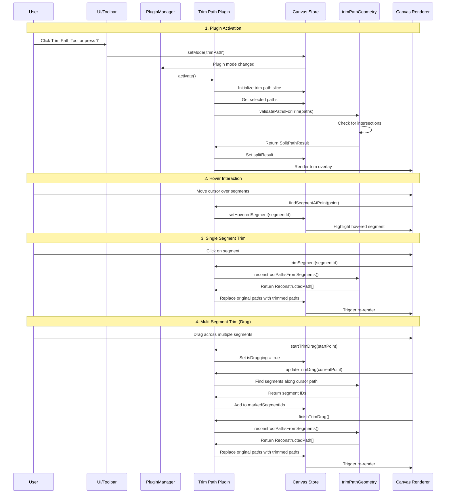

## Trim Path Plugin

**Purpose**: Interactive path trimming at intersection points

## Overview

The Trim Path plugin allows users to trim path segments at their intersection points. This is useful for creating clean cuts in overlapping paths and preparing paths for further editing or boolean operations.

**Key Features:**
- Select 2-5 paths with intersections
- Visual feedback for intersection points and trimmable segments
- Click to trim individual segments
- Drag to trim multiple segments along a path
- Hover highlighting for interactive feedback
- Keyboard shortcuts for activation/deactivation
- Undo/redo support through the main history system

## Plugin Interaction Flow



## State Management

The plugin adds a `trimPath` slice to the global store:

```typescript
interface TrimPathPluginSlice {
  trimPath: {
    /** Whether the trim tool is currently active */
    isActive: boolean;
    
    /** Result of splitting paths by intersections */
    splitResult: SplitPathResult | null;
    
    /** ID of the segment currently under the cursor */
    hoveredSegmentId: string | null;
    
    /** IDs of segments marked for removal during drag */
    markedSegmentIds: string[];
    
    /** Whether the user is currently dragging */
    isDragging: boolean;
    
    /** Path traced by cursor during drag operation */
    cursorPath: Point[];
  };
}
```

## Keyboard Shortcuts

- **`t`**: Toggle trim tool activation/deactivation
- **`Escape`**: Cancel current drag operation or deactivate tool

## UI Components

### Trim Path Overlay

Renders on the canvas foreground to show:
- Intersection points between paths
- Trimmable segments with hover highlighting
- Drag path visualization during multi-segment operations
- Marked segments for removal

Note: The Trim Path tool does not provide a dedicated sidebar panel. All interactions are performed via the canvas overlay and keyboard shortcuts.

## Utility Functions

Located in `src/utils/trimPathGeometry.ts`:

- `validatePathsForTrim()`: Checks if selected paths have intersections
- `computePathIntersections()`: Finds all intersection points between paths
- `splitPathsByIntersections()`: Splits paths into segments at intersection points
- `findSegmentsAlongPath()`: Finds segments intersected by a cursor path
- `reconstructPathsFromSegments()`: Rebuilds paths after segment removal

## Usage Examples

### Basic Single Segment Trim

1. Select 2-5 paths that intersect
2. Activate the Trim Path tool
3. Click on any segment between intersection points to remove it
4. The path is automatically reconstructed without the trimmed segment

### Multi-Segment Trim

1. Select intersecting paths
2. Activate the Trim Path tool
3. Click and drag across multiple segments to mark them for removal
4. Release to trim all marked segments simultaneously

### Keyboard Workflow

1. Select paths: `s` (select tool) + click/drag
2. Activate trim: `t`
3. Trim segments: Click or drag
4. Deactivate: `t` or `Escape`

## Integration Points

- **Canvas Store**: Adds trim path state slice
- **Plugin Manager**: Registers as core plugin
- **Event Bus**: Listens for mode changes and selection updates
- **History System**: All trim operations are undoable
- **Selection System**: Works with currently selected path elements

## Error Handling

- Automatically deactivates if selection changes to non-path elements
- Validates path intersections before activation
- Gracefully handles paths with no intersections
- Prevents operations on locked or hidden elements

## Performance Considerations

- Intersection computation is cached during tool activation
- Segment finding uses spatial indexing for efficiency
- Path reconstruction is optimized to minimize DOM updates
- Large selections (>5 paths) are rejected to maintain performance
---
id: trim-path
title: Trim Path Plugin
sidebar_label: Trim Path
---

# Trim Path Plugin

**Purpose**: Interactive path trimming at intersection points

## Overview

The Trim Path plugin allows users to trim path segments at their intersection points. This is useful for creating clean cuts in overlapping paths and preparing paths for further editing or boolean operations.

**Key Features:**
- Select 2-5 paths with intersections
- Visual feedback for intersection points and trimmable segments
- Click to trim individual segments
- Drag to trim multiple segments along a path
- Hover highlighting for interactive feedback
- Keyboard shortcuts for activation/deactivation
- Undo/redo support through the main history system

## Plugin Interaction Flow


## State Management

The plugin adds a `trimPath` slice to the global store:

```typescript
interface TrimPathPluginSlice {
  trimPath: {
    /** Whether the trim tool is currently active */
    isActive: boolean;
    
    /** Result of splitting paths by intersections */
    splitResult: SplitPathResult | null;
    
    /** ID of the segment currently under the cursor */
    hoveredSegmentId: string | null;
    
    /** IDs of segments marked for removal during drag */
    markedSegmentIds: string[];
    
    /** Whether the user is currently dragging */
    isDragging: boolean;
    
    /** Path traced by cursor during drag operation */
    cursorPath: Point[];
  };
}
```

## Keyboard Shortcuts

- **`t`**: Toggle trim tool activation/deactivation
- **`Escape`**: Cancel current drag operation or deactivate tool

## UI Components

### Trim Path Panel

Provides controls for the trim tool:
- Tool activation status
- Instructions for use
- Visual feedback for current operation

### Trim Path Overlay

Renders on the canvas foreground to show:
- Intersection points between paths
- Trimmable segments with hover highlighting
- Drag path visualization during multi-segment operations
- Marked segments for removal

## Utility Functions

Located in `src/utils/trimPathGeometry.ts`:

- `validatePathsForTrim()`: Checks if selected paths have intersections
- `computePathIntersections()`: Finds all intersection points between paths
- `splitPathsByIntersections()`: Splits paths into segments at intersection points
- `findSegmentsAlongPath()`: Finds segments intersected by a cursor path
- `reconstructPathsFromSegments()`: Rebuilds paths after segment removal

## Usage Examples

### Basic Single Segment Trim

1. Select 2-5 paths that intersect
2. Activate the Trim Path tool
3. Click on any segment between intersection points to remove it
4. The path is automatically reconstructed without the trimmed segment

### Multi-Segment Trim

1. Select intersecting paths
2. Activate the Trim Path tool
3. Click and drag across multiple segments to mark them for removal
4. Release to trim all marked segments simultaneously

### Keyboard Workflow

1. Select paths: `s` (select tool) + click/drag
2. Activate trim: `t`
3. Trim segments: Click or drag
4. Deactivate: `t` or `Escape`

## Integration Points

- **Canvas Store**: Adds trim path state slice
- **Plugin Manager**: Registers as core plugin
- **Event Bus**: Listens for mode changes and selection updates
- **History System**: All trim operations are undoable
- **Selection System**: Works with currently selected path elements

## Error Handling

- Automatically deactivates if selection changes to non-path elements
- Validates path intersections before activation
- Gracefully handles paths with no intersections
- Prevents operations on locked or hidden elements

## Performance Considerations

- Intersection computation is cached during tool activation
- Segment finding uses spatial indexing for efficiency
- Path reconstruction is optimized to minimize DOM updates
- Large selections (>5 paths) are rejected to maintain performance