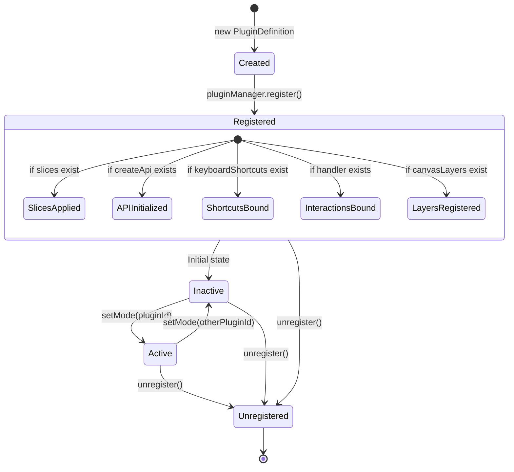
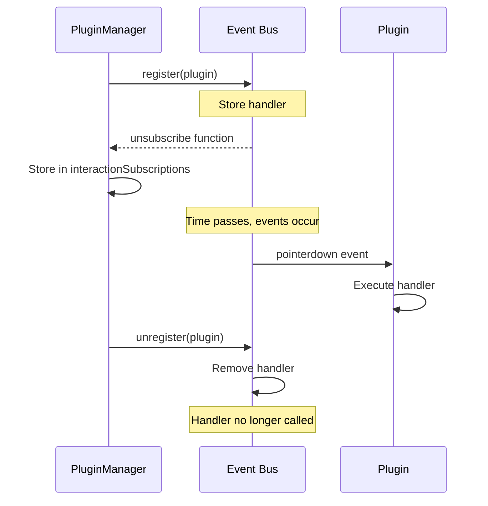

# Plugin Lifecycle

Understanding the plugin lifecycle is crucial for managing resources, subscriptions, and state correctly.

## Lifecycle States



## Registration Phase

### 1. Plugin Created

```typescript
const myPlugin: PluginDefinition = {
  id: 'my-plugin',
  metadata: { label: 'My Plugin' },
  // ... rest of definition
};
```

**State**: Definition object exists in memory
**Can Execute**: No

### 2. Plugin Registered

```typescript
pluginManager.register(myPlugin);
```

**Actions**:
1. Validate plugin ID is unique
2. Store in internal registry `Map<string, PluginDefinition>`
3. Apply slices (if any)
4. Initialize API (if createApi exists)
5. Bind keyboard shortcuts
6. Subscribe to event bus (if handler exists)
7. Register canvas layers

**State**: Plugin known to system
**Can Execute**: Partially (APIs work, handlers don't fire yet)

### 3. Store API Set

```typescript
pluginManager.setStoreApi(canvasStoreApi);
```

**Actions**:
- Re-apply slices for all registered plugins
- Re-initialize all plugin APIs

**State**: Plugin fully connected to store
**Can Execute**: Yes, but handler only fires if plugin is active

### 4. Plugin Inactive

```typescript
const state = useCanvasStore.getState();
// state.activePlugin !== 'my-plugin'
```

**Behavior**:
- Handler does **not** fire on canvas events
- Tool-scoped panels are **hidden**
- Tool-scoped overlays are **hidden**
- Tool-scoped shortcuts are **inactive**
- Global contributions (panels, overlays) **remain active**
- Public API **remains callable**

### 5. Plugin Active

```typescript
const state = useCanvasStore.getState();
state.setMode('my-plugin');
// state.activePlugin === 'my-plugin'
```

**Behavior**:
- Handler **fires** on canvas pointer events
- Tool-scoped panels are **visible**
- Tool-scoped overlays are **visible**
- Tool-scoped shortcuts are **active**
- Cursor changes to plugin's cursor (if specified)

### 6. Plugin Unregistered

```typescript
pluginManager.unregister('my-plugin');
```

**Actions**:
1. Remove from registry
2. Unregister slices (calls cleanup if defined)
3. Remove keyboard shortcuts
4. Unsubscribe from event bus
5. Remove canvas layers
6. Delete plugin API

**State**: Plugin removed from system
**Can Execute**: No

## Event Bus Integration

### Subscription Lifecycle



### Handler Execution Guard

```typescript
// In PluginManager
private bindPluginInteractions(plugin: PluginDefinition): void {
  if (!this.eventBus || !plugin.handler) return;
  
  const unsubscribe = this.eventBus.subscribe('pointerdown', (payload) => {
    // Guard: Only execute if this plugin is active
    if (payload.activePlugin !== plugin.id) return;
    
    // Build context
    const api = this.pluginApis.get(plugin.id) ?? {};
    const context = {
      store: this.requireStoreApi(),
      api,
      helpers: payload.helpers,
    };
    
    // Execute handler
    plugin.handler!(payload.event, payload.point, payload.target as Element, context);
  });
  
  this.addInteractionSubscription(plugin.id, unsubscribe);
}
```

## Slice Lifecycle

### Slice Registration

```typescript
export const registerPluginSlices = (
  storeApi: CanvasStoreApi,
  pluginId: string,
  contributions: CanvasPluginSlice[]
): void => {
  if (contributions.length === 0) return;
  
  // Unregister old slices if any
  unregisterPluginSlices(storeApi, pluginId);
  
  const cleanups: Array<() => void> = [];
  
  contributions.forEach(({ state, cleanup }) => {
    // Apply state to store
    cleanups.push(applyPluginSlice(storeApi, state));
    
    // Store cleanup function
    if (cleanup) {
      cleanups.push(() => cleanup(storeApi.setState, storeApi.getState, storeApi));
    }
  });
  
  // Store all cleanups
  pluginSliceCleanups.set(pluginId, cleanups);
};
```

### Slice Unregistration

```typescript
export function unregisterPluginSlices(storeApi: CanvasStoreApi, pluginId: string): void {
  const cleanups = pluginSliceCleanups.get(pluginId);
  if (!cleanups) return;
  
  // Execute all cleanup functions
  cleanups.forEach(cleanup => cleanup());
  
  // Remove from map
  pluginSliceCleanups.delete(pluginId);
  
  // Note: Slice state remains in store (Zustand doesn't support removal)
  // Set properties to undefined/null if needed
}
```

## API Lifecycle

### API Initialization

```typescript
private initializePluginApi(plugin: PluginDefinition): void {
  if (!plugin.createApi) {
    this.pluginApis.delete(plugin.id);
    return;
  }
  
  const context = this.createPluginApiContext();
  const api = plugin.createApi(context);
  
  this.pluginApis.set(plugin.id, api);
}
```

### API Access

```typescript
// Direct access
const api = pluginManager.getPluginApi<MyAPI>('my-plugin');
if (api) {
  api.doSomething();
}

// Proxied call
const result = pluginManager.callPluginApi('my-plugin', 'doSomething', arg1, arg2);
```

### API Cleanup

```typescript
// On unregister
pluginManager.unregister('my-plugin');
// API is deleted from pluginApis Map
// Existing references become stale
```

## Shortcut Lifecycle

### Binding

```typescript
private bindPluginShortcuts(plugin: PluginDefinition): void {
  if (!plugin.keyboardShortcuts) return;
  
  const scopedShortcuts: CanvasShortcutMap = {};
  
  Object.entries(plugin.keyboardShortcuts).forEach(([key, definition]) => {
    const normalized = this.normalizeShortcutDefinition(definition);
    
    scopedShortcuts[key] = {
      ...normalized,
      handler: (event) => {
        const state = this.requireStoreApi().getState();
        
        // Guard: Only execute if plugin is active
        if (state.activePlugin !== plugin.id) return;
        
        const context = this.createPluginApiContext();
        normalized.handler(event, context);
      },
    };
  });
  
  const unsubscribe = canvasShortcutRegistry.register(
    `plugin:${plugin.id}`,
    scopedShortcuts
  );
  
  this.shortcutSubscriptions.set(plugin.id, unsubscribe);
}
```

### Cleanup

```typescript
private teardownPluginShortcuts(pluginId: string): void {
  const unsubscribe = this.shortcutSubscriptions.get(pluginId);
  if (unsubscribe) {
    unsubscribe();
    this.shortcutSubscriptions.delete(pluginId);
  }
}
```

## Canvas Service Lifecycle

Canvas services are independent of plugins but managed by PluginManager:

### Service Registration

```typescript
pluginManager.registerCanvasService({
  id: 'my-service',
  create: (context) => {
    // Setup
    const listener = (e: PointerEvent) => { /* ... */ };
    context.svg.addEventListener('pointermove', listener);
    
    return {
      update: (state) => {
        // Handle state updates
      },
      dispose: () => {
        // Cleanup
        context.svg.removeEventListener('pointermove', listener);
      },
    };
  },
});
```

### Service Activation

```typescript
const context: CanvasServiceContext = {
  svg,
  controller,
  eventBus,
  store: canvasStoreApi,
};

const unsubscribe = pluginManager.activateCanvasService('my-service', context);

// Later...
unsubscribe(); // Calls dispose()
```

## Resource Management

### Memory Leaks to Avoid

#### 1. Event Listeners Not Removed

```typescript
// ❌ Memory leak
handler: (event, point, target, context) => {
  window.addEventListener('resize', () => { /* ... */ });
  // Never removed!
};

// ✅ Proper cleanup
slices: [
  (set, get, api) => {
    let resizeHandler: (() => void) | null = null;
    
    return {
      state: {
        setupListener: () => {
          resizeHandler = () => { /* ... */ };
          window.addEventListener('resize', resizeHandler);
        },
      },
      cleanup: () => {
        if (resizeHandler) {
          window.removeEventListener('resize', resizeHandler);
        }
      },
    };
  },
],
```

#### 2. Intervals/Timeouts Not Cleared

```typescript
// ❌ Memory leak
let intervalId: number;
handler: () => {
  intervalId = window.setInterval(() => { /* ... */ }, 1000);
  // Never cleared!
};

// ✅ Proper cleanup
slices: [
  (set, get, api) => {
    let intervalId: number | null = null;
    
    return {
      state: {
        startPolling: () => {
          intervalId = window.setInterval(() => { /* ... */ }, 1000);
        },
      },
      cleanup: () => {
        if (intervalId !== null) {
          window.clearInterval(intervalId);
        }
      },
    };
  },
],
```

#### 3. Subscriptions Not Unsubscribed

```typescript
// ❌ Memory leak
handler: (event, point, target, context) => {
  context.store.subscribe((state) => {
    console.log(state);
    // Subscription never removed!
  });
};

// ✅ Proper cleanup
slices: [
  (set, get, api) => {
    let unsubscribe: (() => void) | null = null;
    
    return {
      state: {
        setupSubscription: () => {
          unsubscribe = api.subscribe((state) => {
            console.log(state);
          });
        },
      },
      cleanup: () => {
        unsubscribe?.();
      },
    };
  },
],
```

## Lifecycle Hooks Pattern

Proposed pattern for future enhancement:

```typescript
interface PluginDefinition {
  // ... existing properties
  
  // Lifecycle hooks
  onRegister?: (context: PluginContext) => void;
  onUnregister?: (context: PluginContext) => void;
  onActivate?: (context: PluginContext) => void;
  onDeactivate?: (context: PluginContext) => void;
}
```

**Current workaround**: Use slice cleanup and event bus subscriptions.

## Best Practices

### 1. Idempotent Registration

Plugins should handle multiple register/unregister cycles:

```typescript
// PluginManager already handles this
pluginManager.register(plugin); // OK
pluginManager.register(plugin); // Unregisters old, registers new
```

### 2. Defensive Cleanup

Always check before cleanup:

```typescript
cleanup: () => {
  if (listener) removeListener();
  if (interval) clearInterval(interval);
  if (unsubscribe) unsubscribe();
};
```

### 3. State Reset

Reset plugin state in cleanup if needed:

```typescript
cleanup: (set) => {
  set({ myPluginData: [], myPluginSettings: defaultSettings });
};
```

### 4. Avoid Circular Dependencies

Don't call Plugin A's API from Plugin B's createApi factory:

```typescript
// ❌ Circular dependency
createApi: (context) => ({
  init: () => {
    const otherApi = pluginManager.getPluginApi('other');
    otherApi?.callMe(); // otherApi might not exist yet!
  },
});

// ✅ Call in handler or action
handler: (event, point, target, context) => {
  const otherApi = pluginManager.getPluginApi('other');
  otherApi?.callMe(); // Safe, all plugins registered
};
```

## Debugging Lifecycle Issues

### Check Registration

```typescript
console.log(pluginManager.hasTool('my-plugin')); // true if registered
console.log(pluginManager.getPlugin('my-plugin')); // Definition or undefined
```

### Check Active State

```typescript
const state = useCanvasStore.getState();
console.log(state.activePlugin); // Current active plugin ID
```

### Check API Availability

```typescript
const api = pluginManager.getPluginApi('my-plugin');
console.log(api); // API object or undefined
```

### Check Event Subscriptions

```typescript
// In PluginManager (dev mode)
console.log(this.interactionSubscriptions.get('my-plugin'));
// Set of unsubscribe functions
```

## Next Steps

- **[Plugin Registration](./registration)**: How registration works under the hood
- **[Plugin Configuration](./configuration)**: Advanced configuration options
- **[Plugin Catalog](./catalog/select)**: Examples from built-in plugins
