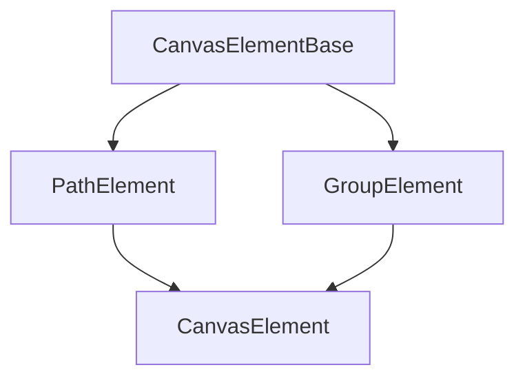

# Canvas Elements

Canvas elements are the fundamental building blocks of the Vectornest canvas. Every shape, path, or group on the canvas is represented by a strongly-typed element.

## Element Type Hierarchy



## Base Types

### CanvasElementBase

The base interface shared by all canvas elements.

```typescript
interface CanvasElementBase {
  id: string;              // Unique identifier (UUID)
  type: ElementType;       // Discriminant: 'path' | 'group'
  zIndex: number;          // Stacking order (higher = front)
  parentId?: string | null; // ID of parent group, if any
}
```

### ElementType

Discriminant type for element variants:

```typescript
type ElementType = 'path' | 'group';
```

## Path Elements

### PathElement

Represents a vector path with SVG properties.

```typescript
interface PathElement extends CanvasElementBase {
  type: 'path';
  data: PathData;
}
```

### PathData

Complete data structure for a path element:

```typescript
interface PathData {
  subPaths: SubPath[];              // Array of command sequences
  strokeWidth: number;              // Stroke thickness in pixels
  strokeColor: string;              // Hex color (#RRGGBB)
  strokeOpacity: number;            // 0.0 to 1.0
  fillColor: string;                // Hex color (#RRGGBB)
  fillOpacity: number;              // 0.0 to 1.0
  strokeLinecap?: 'butt' | 'round' | 'square';
  strokeLinejoin?: 'miter' | 'round' | 'bevel';
  fillRule?: 'nonzero' | 'evenodd';
  strokeDasharray?: string;         // SVG dash pattern (e.g., "5,5")
  isPencilPath?: boolean;           // Created with pencil tool flag
  transform?: {
    scaleX: number;
    scaleY: number;
    rotation: number;                // Radians
    translateX: number;
    translateY: number;
  };
}
```

**Key Properties:**

- **subPaths**: Array of command sequences, each representing a contiguous path
- **SVG Properties**: Direct mapping to SVG path attributes
- **isPencilPath**: Marks paths created with the pencil tool for special handling
- **transform**: Optional transformation matrix components

**Precision:**

Path coordinates use configurable decimal precision:

```typescript
const PATH_DECIMAL_PRECISION = 2; // 2 decimal places
```

## Group Elements

### GroupElement

Represents a container that groups multiple elements together.

```typescript
interface GroupElement extends CanvasElementBase {
  type: 'group';
  data: GroupData;
}
```

### GroupData

Data structure for group properties:

```typescript
interface GroupData {
  childIds: string[];       // IDs of contained elements
  name: string;             // User-facing group name
  isLocked: boolean;        // Prevents editing
  isHidden: boolean;        // Visibility toggle
  isExpanded: boolean;      // Sidebar expansion state
  transform: {
    translateX: number;
    translateY: number;
    rotation: number;       // Radians
    scaleX: number;
    scaleY: number;
  };
}
```

**Transform Hierarchy:**

Group transforms are applied to all children. Child transforms are relative to the parent.

## Union Type

### CanvasElement

Discriminated union of all element types:

```typescript
type CanvasElement = PathElement | GroupElement;
```

**Type Narrowing:**

```typescript
function processElement(element: CanvasElement) {
  if (element.type === 'path') {
    // element is PathElement
    console.log(element.data.strokeColor);
  } else {
    // element is GroupElement
    console.log(element.data.childIds.length);
  }
}
```

## Usage Examples

### Creating a Path Element

```typescript
const pathElement: PathElement = {
  id: crypto.randomUUID(),
  type: 'path',
  zIndex: 0,
  parentId: null,
  data: {
    subPaths: [
      [
        { type: 'M', position: { x: 0, y: 0 } },
        { type: 'L', position: { x: 100, y: 100 } },
      ],
    ],
    strokeWidth: 2,
    strokeColor: '#000000',
    strokeOpacity: 1,
    fillColor: '#ffffff',
    fillOpacity: 0,
  },
};
```

### Creating a Group Element

```typescript
const groupElement: GroupElement = {
  id: crypto.randomUUID(),
  type: 'group',
  zIndex: 0,
  parentId: null,
  data: {
    childIds: ['path-id-1', 'path-id-2'],
    name: 'My Group',
    isLocked: false,
    isHidden: false,
    isExpanded: true,
    transform: {
      translateX: 0,
      translateY: 0,
      rotation: 0,
      scaleX: 1,
      scaleY: 1,
    },
  },
};
```

### Type Guards

```typescript
function isPathElement(element: CanvasElement): element is PathElement {
  return element.type === 'path';
}

function isGroupElement(element: CanvasElement): element is GroupElement {
  return element.type === 'group';
}
```

## See Also

- [Geometry Types](./geometry.md) - Point and command types used in paths
- [Selection Types](./selection.md) - Types for selecting elements
- [Plugin Context](./plugin-context.md) - How plugins interact with elements
