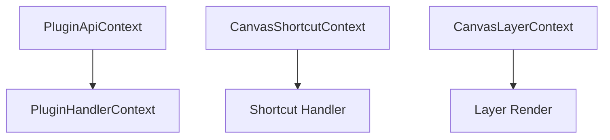

# Plugin Context

Plugin context types provide the runtime environment and APIs available to plugin handlers during execution.

## Context Hierarchy



## Store Context

### PluginStoreApi

Subset of Zustand store API exposed to plugins:

```typescript
type PluginStoreApi<TStore extends object> = Pick<
  StoreApi<TStore>, 
  'getState' | 'setState' | 'subscribe'
>;
```

**Methods:**

- **getState()**: Get current store state snapshot
- **setState(partial)**: Update store state
- **subscribe(listener)**: Subscribe to state changes

**Example:**

```typescript
const store: PluginStoreApi<MyStore> = {
  getState: () => ({ count: 0 }),
  setState: (partial) => { /* ... */ },
  subscribe: (listener) => { /* ... */ },
};

// Get state
const state = store.getState();

// Update state
store.setState({ count: state.count + 1 });

// Subscribe to changes
const unsubscribe = store.subscribe((newState) => {
  console.log('State changed:', newState);
});
```

### PluginApiContext

Base context providing store access:

```typescript
interface PluginApiContext<TStore extends object> {
  store: PluginStoreApi<TStore>;
}
```

**Usage:**

```typescript
function myApiFactory(context: PluginApiContext<MyStore>) {
  return {
    increment: () => {
      const state = context.store.getState();
      context.store.setState({ count: state.count + 1 });
    },
  };
}
```

## Handler Context

### PluginHandlerContext

Extended context for pointer event handlers:

```typescript
interface PluginHandlerContext<TStore extends object> 
  extends PluginApiContext<TStore> {
  api: Record<string, (...args: never[]) => unknown>;
  helpers: PluginHandlerHelpers;
}
```

**Properties:**

- **store**: Store API for state access
- **api**: Object containing all plugin APIs
- **helpers**: Utility functions and helpers

**Example:**

```typescript
handler: (event, point, target, context) => {
  // Access store
  const state = context.store.getState();
  
  // Call other plugin APIs
  context.api.selection.selectElement('path-123');
  
  // Use helpers
  const bounds = context.helpers.getBounds('path-123');
}
```

### PluginHandlerHelpers

Utility functions provided to handlers:

```typescript
type PluginHandlerHelpers = Record<string, any>;
```

**Common Helpers:**

```typescript
interface CommonHelpers {
  // Bounds calculation
  getBounds: (elementId: string) => Bounds | null;
  
  // Transform utilities
  applyTransform: (point: Point, transform: Transform) => Point;
  
  // Path utilities
  getPathLength: (subPath: SubPath) => number;
  
  // Hit testing
  isPointInPath: (point: Point, elementId: string) => boolean;
}
```

## Shortcut Context

### CanvasShortcutStoreApi

Store API for keyboard shortcuts:

```typescript
type CanvasShortcutStoreApi = Pick<
  StoreApi<object>, 
  'getState' | 'subscribe'
>;
```

Note: Shortcuts only have read access (no `setState`).

### CanvasShortcutContext

Context provided to keyboard shortcut handlers:

```typescript
interface CanvasShortcutContext {
  eventBus: CanvasEventBus;
  controller: CanvasControllerValue;
  store: CanvasShortcutStoreApi;
  svg?: SVGSVGElement | null;
}
```

**Properties:**

- **eventBus**: Event bus for publishing/subscribing to events
- **controller**: Canvas controller for tool/mode changes
- **store**: Read-only store access
- **svg**: Reference to the SVG element (if available)

**Example:**

```typescript
keyboardShortcuts: {
  'Delete': (event, context) => {
    const state = context.store.getState();
    const selectedIds = state.selectedIds;
    
    context.eventBus.publish('canvas:elements:delete', { 
      elementIds: selectedIds 
    });
  },
}
```

## Layer Context

### CanvasLayerContext

Extended context for canvas layer rendering:

```typescript
interface CanvasLayerContext 
  extends CanvasControllerValue, 
          Record<string, any> {
  canvasSize: { width: number; height: number };
  isSelecting: boolean;
  selectionStart: Point | null;
  selectionEnd: Point | null;
  selectedGroupBounds: Array<{ id: string; bounds: Bounds }>;
  dragPosition: Point | null;
  isDragging: boolean;
  getElementBounds: (element: CanvasElement) => Bounds | null;
  setDragStart: (point: Point | null) => void;
  pointPositionFeedback?: PointPositionFeedback;
}
```

**Canvas State:**

- **canvasSize**: Current canvas dimensions
- **isSelecting**: Whether marquee selection is active
- **selectionStart/End**: Marquee selection bounds
- **selectedGroupBounds**: Bounds of all selected elements

**Drag State:**

- **dragPosition**: Current drag position (if dragging)
- **isDragging**: Whether elements are being dragged
- **setDragStart**: Function to initiate drag

**Utilities:**

- **getElementBounds**: Calculate element bounds
- **pointPositionFeedback**: Real-time position feedback data

**Example:**

```typescript
canvasLayers: [
  {
    id: 'selection-box',
    placement: 'foreground',
    render: (context) => {
      if (!context.isSelecting || !context.selectionStart || !context.selectionEnd) {
        return null;
      }
      
      const x = Math.min(context.selectionStart.x, context.selectionEnd.x);
      const y = Math.min(context.selectionStart.y, context.selectionEnd.y);
      const width = Math.abs(context.selectionEnd.x - context.selectionStart.x);
      const height = Math.abs(context.selectionEnd.y - context.selectionStart.y);
      
      return (
        <rect
          x={x}
          y={y}
          width={width}
          height={height}
          stroke="blue"
          fill="blue"
          fillOpacity={0.1}
        />
      );
    },
  },
]
```

## Controller Value

### CanvasControllerValue

Canvas controller interface (extended by layer context):

```typescript
interface CanvasControllerValue {
  activeTool: string | null;
  setActiveTool: (toolId: string | null) => void;
  mode: string;
  setMode: (mode: string) => void;
  // ... other controller methods
}
```

**Common Methods:**

- **setActiveTool(id)**: Switch to a different tool
- **setMode(mode)**: Change canvas mode (e.g., 'edit', 'select')
- **clearSelection()**: Clear all selections
- **zoomToFit()**: Zoom to fit all content

## Usage Patterns

### Accessing Store State

```typescript
handler: (event, point, target, context) => {
  // Get current state
  const state = context.store.getState();
  
  // Read values
  console.log('Selected:', state.selectedIds);
  console.log('Zoom:', state.viewport.zoom);
}
```

### Updating Store State

```typescript
handler: (event, point, target, context) => {
  // Update state
  context.store.setState({
    isDrawing: true,
    currentPoint: point,
  });
  
  // Update with function
  context.store.setState((state) => ({
    points: [...state.points, point],
  }));
}
```

### Using Plugin APIs

```typescript
handler: (event, point, target, context) => {
  // Call API from another plugin
  const bounds = context.api.selection.getSelectionBounds();
  
  // Call multiple APIs
  context.api.canvas.addPath(pathData);
  context.api.history.recordAction('create-path');
}
```

### Subscribing to State Changes

```typescript
slices: [
  (set, get, api) => {
    // Subscribe during initialization
    const unsubscribe = api.subscribe((state) => {
      console.log('State changed:', state);
    });
    
    return {
      state: { /* initial state */ },
      cleanup: () => {
        unsubscribe();
      },
    };
  },
]
```

### Using Event Bus in Shortcuts

```typescript
keyboardShortcuts: {
  'Ctrl+D': (event, context) => {
    // Publish event
    context.eventBus.publish('canvas:duplicate', {
      elementIds: context.store.getState().selectedIds,
    });
  },
  
  'Ctrl+G': (event, context) => {
    // Subscribe to event
    const unsub = context.eventBus.subscribe('canvas:grouped', (data) => {
      console.log('Elements grouped:', data.groupId);
    });
  },
}
```

## Type Safety

### Generic Store Types

Plugins can define their own store shape:

```typescript
interface MyPluginStore {
  myPluginState: {
    isActive: boolean;
    data: string[];
  };
}

const plugin: PluginDefinition<MyPluginStore> = {
  handler: (event, point, target, context) => {
    // context.store is typed as PluginStoreApi<MyPluginStore>
    const state = context.store.getState();
    console.log(state.myPluginState.isActive); // Type-safe!
  },
};
```

### Type Narrowing

```typescript
handler: (event, point, target, context) => {
  const state = context.store.getState();
  
  // Type guard for plugin-specific state
  if ('myPluginState' in state) {
    console.log(state.myPluginState);
  }
}
```

## Best Practices

1. **Minimize State Reads**: Cache `getState()` results within a handler
2. **Batch Updates**: Group related `setState()` calls
3. **Clean Up Subscriptions**: Always unsubscribe in cleanup functions
4. **Type Your Store**: Define explicit store interfaces for type safety
5. **Use Event Bus**: Prefer event bus for cross-plugin communication

## See Also

- [Plugin Definition](./plugin-definition.md) - Complete plugin structure
- [Plugin Contributions](./plugin-contributions.md) - UI and layer contributions
- [Event Bus](../event-bus/overview.md) - Event-driven communication
- [Canvas Store](../api/canvas-store.md) - Store structure and APIs
