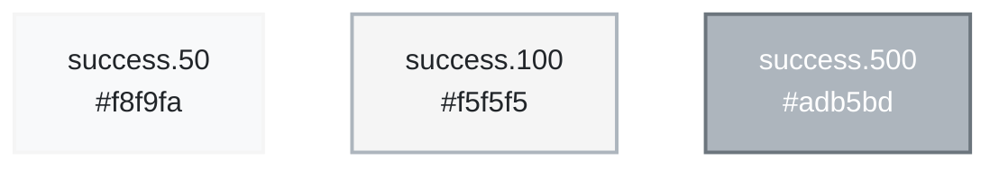
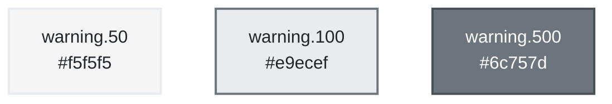
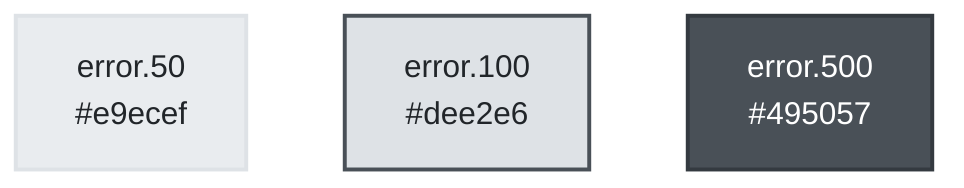

# Theming

TTPE uses Chakra UI with custom theme tokens.

## Color Tokens

### Light Mode

```json
{
  "colors": {
    "brand": {
      "500": "#6c757d"
    },
    "gray": {
      "50": "#f8f9fa",
      "100": "#f5f5f5",
      "200": "#e9ecef",
      "500": "#adb5bd",
      "800": "#343a40"
    }
  },
  "semanticTokens": {
    "surface.canvas": "gray.50",
    "surface.panel": "white",
    "text.primary": "gray.800",
    "text.muted": "gray.600"
  }
}
```

### Dark Mode

```json
{
  "semanticTokens": {
    "surface.canvas": "gray.900",
    "surface.panel": "gray.800",
    "text.primary": "gray.100",
    "text.muted": "gray.400"
  }
}
```

## Color Palette Specimens

### Brand Colors

```mermaid
graph TD
    A[brand.50<br/>#f8f9fa]:::brand50
    B[brand.100<br/>#e9ecef]:::brand100
    C[brand.200<br/>#dee2e6]:::brand200
    D[brand.300<br/>#ced4da]:::brand300
    E[brand.400<br/>#adb5bd]:::brand400
    F[brand.500<br/>#6c757d]:::brand500
    G[brand.600<br/>#495057]:::brand600
    H[brand.700<br/>#343a40]:::brand700
    I[brand.800<br/>#212529]:::brand800
    J[brand.900<br/>#000000]:::brand900

    classDef brand50 fill:#f8f9fa,stroke:#e9ecef,stroke-width:2px,color:#212529
    classDef brand100 fill:#e9ecef,stroke:#dee2e6,stroke-width:2px,color:#212529
    classDef brand200 fill:#dee2e6,stroke:#ced4da,stroke-width:2px,color:#212529
    classDef brand300 fill:#ced4da,stroke:#adb5bd,stroke-width:2px,color:#212529
    classDef brand400 fill:#adb5bd,stroke:#6c757d,stroke-width:2px,color:#212529
    classDef brand500 fill:#6c757d,stroke:#495057,stroke-width:2px,color:#ffffff
    classDef brand600 fill:#495057,stroke:#343a40,stroke-width:2px,color:#ffffff
    classDef brand700 fill:#343a40,stroke:#212529,stroke-width:2px,color:#ffffff
    classDef brand800 fill:#212529,stroke:#000000,stroke-width:2px,color:#ffffff
    classDef brand900 fill:#000000,stroke:#000000,stroke-width:2px,color:#ffffff
```



### Gray Scale

```mermaid
graph TD
    A[gray.50<br/>#f8f9fa]:::gray50
    B[gray.100<br/>#f5f5f5]:::gray100
    C[gray.200<br/>#e9ecef]:::gray200
    D[gray.300<br/>#dee2e6]:::gray300
    E[gray.400<br/>#ced4da]:::gray400
    F[gray.500<br/>#adb5bd]:::gray500
    G[gray.600<br/>#6c757d]:::gray600
    H[gray.700<br/>#495057]:::gray700
    I[gray.800<br/>#343a40]:::gray800
    J[gray.900<br/>#212529]:::gray900

    classDef gray50 fill:#f8f9fa,stroke:#e9ecef,stroke-width:2px,color:#212529
    classDef gray100 fill:#f5f5f5,stroke:#e9ecef,stroke-width:2px,color:#212529
    classDef gray200 fill:#e9ecef,stroke:#dee2e6,stroke-width:2px,color:#212529
    classDef gray300 fill:#dee2e6,stroke:#ced4da,stroke-width:2px,color:#212529
    classDef gray400 fill:#ced4da,stroke:#adb5bd,stroke-width:2px,color:#212529
    classDef gray500 fill:#adb5bd,stroke:#6c757d,stroke-width:2px,color:#ffffff
    classDef gray600 fill:#6c757d,stroke:#495057,stroke-width:2px,color:#ffffff
    classDef gray700 fill:#495057,stroke:#343a40,stroke-width:2px,color:#ffffff
    classDef gray800 fill:#343a40,stroke:#212529,stroke-width:2px,color:#ffffff
    classDef gray900 fill:#212529,stroke:#000000,stroke-width:2px,color:#ffffff
```



### Semantic Colors

#### Success



#### Warning



#### Error



#### Info


## Typography

- **Font Family**: System fonts (-apple-system, BlinkMacSystemFont, Segoe UI)
- **Font Sizes**: sm (14px), md (16px), lg (18px)
- **Line Heights**: normal (1.5), tight (1.25)

## Spacing

- Base unit: 4px
- Scale: 0, 1, 2, 3, 4, 6, 8, 12, 16, 24, 32, 48, 64

## Border Radius

- `sm`: 2px
- `md`: 4px
- `lg`: 8px
- `full`: 9999px

## Usage

```tsx
import { useColorMode } from '@chakra-ui/react';

const { colorMode, toggleColorMode } = useColorMode();
```

See `src/theme/` for complete theme configuration.
